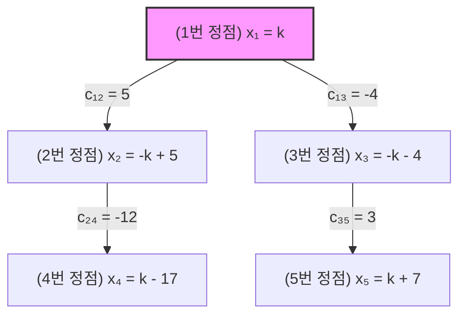

<style>.post-tail-wrapper .license-wrapper { display: none; }</style>

## 1. 개요

이번에 해결해 본 문제는 [KOI 그래프 균형](https://jungol.co.kr/problem/4799)이다. 목표는 모든 정점에 정수 가중치 $x_i$를 부여하여 각 간선이 잇는 두 정점의 합이 간선의 가중치와 같도록 맞추면서, 전체 정점 가중치의 절댓값의 합 $\sum_{i=1}^{N} |x_i|$를 **250ms 이내**로 최적화하여 최소화하는 것이다.

문제는 **2021 KOI 2차 고등부 2번** 에 출제된 문제다.

<!-- 이미지 자리: 정올 4799 문제 메인 화면 사진 -->

_KOI 그래프 균형 문제 화면._

---

## 2. 문제 접근: 일차식 모델링

그래프가 무방향 단순 연결 그래프로 주어진다. 각 간선 $j$는 정점 $a_j$와 $b_j$를 연결하며, 다음과 같은 수식을 만족해야 한다.

$$x_{a_j} + x_{b_j} = c_j$$

정점의 개수 $N$이 최대 10만, 간선의 개수 $M$이 최대 20만이므로, 일반적인 연립방정식(가우스 소거법 등)으로는 풀 수 없다. 대신 그래프가 **연결 그래프**라는 점을 이용한다.

1번 정점의 가중치 $x_1$을 미지수 $k$ ($x_1 = 1 \cdot k + 0$)로 설정하면, DFS/BFS 탐색을 통해 나머지 모든 정점 $i$의 가중치 $x_i$를 $k$에 대한 1차식으로 나타낼 수 있다.

$$x_i = A_i \cdot k + B_i \quad (A_i \in \{1, -1\})$$


_정점 가중치를 k에 대한 일차식 A_i * k + B_i 로 모델링한 구조._

---

## 3. 홀수/짝수 사이클과 모순 검증

DFS 탐색 과정에서 이미 방문한 정점을 다시 만나는 경우는 그래프 내에 **사이클(Cycle)**이 존재할 때이다.

간선 $(u, v)$에 대해 기존에 구한 식 $(A_u k + B_u) + (A_v k + B_v) = c_j$를 대입하면:

$$(A_u + A_v)k + (B_u + B_v) = c_j$$

### 3.1 홀수 사이클 (Odd Cycle)
$A_u + A_v \neq 0$ 인 경우 ($A_u = A_v = 1$ 또는 $-1$), $k$의 계수가 0이 되지 않으므로 $k$ 값이 정해진다.

$$k = \frac{c_j - (B_u + B_v)}{A_u + A_v}$$

이 $k$ 값이 **정수**이어야 하며, 만약 이미 다른 홀수 사이클에서 구해진 $k$와 값이 다르거나 정수가 아니라면 모순이므로 `No`를 출력한다.

### 3.2 짝수 사이클 (Even Cycle)
$A_u + A_v = 0$ 인 경우 ($A_u = 1, A_v = -1$), $k$가 상쇄된다.

$$B_u + B_v = c_j$$

상수항의 합이 간선의 가중치 $c_j$와 다르면 모순이므로 `No`를 출력한다. 일치하면 $k$의 값에 영향을 주지 않고 탐색을 계속한다.

---

## 4. 중간값(Median)을 이용한 최소 비용 결정

모순 없이 탐색이 끝났을 때 $k$를 결정하는 방법은 두 가지이다.

1. **$k$가 홀수 사이클에 의해 고정된 경우:** 고정된 $k$ 값으로 모든 정점의 $x_i$를 확정한다.
2. **$k$가 자유 변수(Free Variable)인 경우 (트리 또는 짝수 사이클만 존재):** 총 비용 $\sum_{i=1}^{N} |x_i|$를 최소화하는 정수 $k$를 찾아야 한다.

$A_i \in \{1, -1\}$ 이므로 절댓값의 합은 다음과 같다.

$$\sum_{i=1}^{N} |A_i k + B_i| = \sum_{i=1}^{N} |k - (-A_i B_i)|$$

이 식은 $k$가 Target 값들인 $T_i = -A_i B_i$ 의 **중간값(Median)**에 위치할 때 최소가 됨이 수학적으로 증명되어 있다. 따라서 $T_i$ 배열을 정렬한 뒤 `T[N / 2]`를 $k$ 값으로 채택한다.

---

## 5. 250ms 목표 달성을 위한 최적화

* **Fast I/O:** `ios_base::sync_with_stdio(false); cin.tie(NULL);` 적용으로 대용량 입출력 오버헤드 제거.
* **선형 탐색 최적화:** DFS 1회 ($O(N+M)$) + 정렬 1회 ($O(N \log N)$) 로 시간 복잡도를 $O(N \log N + M)$ 수준으로 유지하여 250ms 시간 제한을 통과한다.

---

## 6. 제출 및 검증 결과

알고리즘 구현 후 채점 사이트에 코드를 제출하여 최종 정답 판정을 받았다.


_사이트 제출 결과 및 "정답입니다" 화면._

---

## 7. 전체 C++17 코드

```cpp
#include <iostream>
#include <vector>
#include <cmath>
#include <algorithm>

using namespace std;

struct Edge {
    int to;
    long long cost;
};

int N, M;
vector<vector<Edge>> adj;
vector<bool> visited;
vector<long long> A, B; // x_i = A[i] * k + B[i]

bool fixed_k = false;
double k_val = 0;
bool possible = true;

void dfs(int u) {
    for (const auto& edge : adj[u]) {
        int v = edge.to;
        long long c = edge.cost;

        if (!visited[v]) {
            visited[v] = true;
            A[v] = -A[u];
            B[v] = c - B[u];
            dfs(v);
        } else {
            long long coeff = A[u] + A[v];
            long long const_val = B[u] + B[v];

            if (coeff != 0) { // 홀수 사이클: k 값이 고정됨
                double found_k = (double)(c - const_val) / coeff;
                if (fixed_k) {
                    if (abs(found_k - k_val) > 1e-9) possible = false;
                } else {
                    fixed_k = true;
                    k_val = found_k;
                }
            } else { // 짝수 사이클: 상수가 일치해야 함
                if (const_val != c) possible = false;
            }
        }
    }
}

int main() {
    // Fast I/O (250ms 시간 초과 방지)
    ios_base::sync_with_stdio(false);
    cin.tie(NULL);

    if (!(cin >> N >> M)) return 0;

    adj.resize(N + 1);
    visited.assign(N + 1, false);
    A.resize(N + 1);
    B.resize(N + 1);

    for (int i = 0; i < M; i++) {
        int u, v;
        long long c;
        cin >> u >> v >> c;
        adj[u].push_back({v, c});
        adj[v].push_back({u, c});
    }

    // 1번 정점을 기준(x_1 = 1 * k + 0)으로 설정
    visited[1] = true;
    A[1] = 1;
    B[1] = 0;

    dfs(1);

    if (!possible) {
        cout << "No\n";
        return 0;
    }

    long long final_k = 0;

    if (fixed_k) {
        // 홀수 사이클로 인해 k가 고정된 경우
        long long rounded_k = round(k_val);
        if (abs(k_val - rounded_k) > 1e-9) {
            cout << "No\n";
            return 0;
        }
        final_k = rounded_k;
    } else {
        // k가 자유 변수인 경우: 중간값(Median)을 이용해 최소화
        vector<long long> targets;
        targets.reserve(N);
        for (int i = 1; i <= N; i++) {
            targets.push_back(-A[i] * B[i]);
        }
        sort(targets.begin(), targets.end());
        final_k = targets[N / 2];
    }

    // 정점 가중치 계산
    vector<long long> X(N + 1);
    for (int i = 1; i <= N; i++) {
        X[i] = A[i] * final_k + B[i];
    }

    // 모든 간선 조건 검증
    for (int u = 1; u <= N; u++) {
        for (const auto& edge : adj[u]) {
            if (X[u] + X[edge.to] != edge.cost) {
                cout << "No\n";
                return 0;
            }
        }
    }

    // 결과 출력
    cout << "Yes\n";
    for (int i = 1; i <= N; i++) {
        cout << X[i] << (i == N ? "" : " ");
    }
    cout << "\n";

    return 0;
}