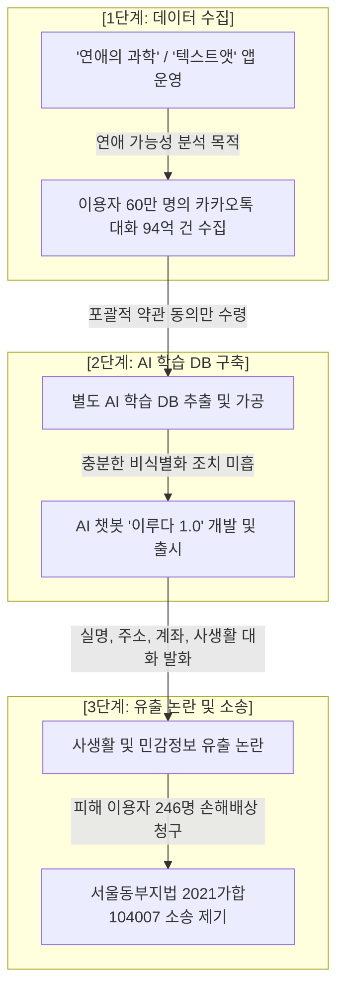

## 1. 판례 기본 정보

* **사건명**: 손해배상(기)
* **사건번호**: 서울동부지방법원 2021가합104007 판결
* **법원 및 재판부**: 서울동부지방법원 민사합의15부 (재판장 조용래 부장판사)
* **선고일자**: 2025년 6월 12일 선고 (2025. 7. 판결 공개)
* **참고 및 사실확인 링크**:
  * [대한변협신문: AI 챗봇 '이루다' 개인정보 무단 활용… 법원 "위자료 지급하라"](https://news.koreanbar.or.kr/news/articleView.html?idxno=33912)
  * [중앙일보: AI챗봇이 몰래 학습한 내 개인정보 얼마?…法 "최대 40만원 배상"](https://www.joongang.co.kr/article/25351547)
  * [대한민국 법원 대고민서비스 (사건 조회용)](https://www.scourt.go.kr) *(※ 서울동부지방법원 2021가합104007 검색 시 진행사항 확인 가능)*

---

## 2. 사건의 경위 및 문제가 된 개인정보

### (1) 사건의 전개 과정



1. **데이터 수집**: 피고(주식회사 스캐터랩)는 연애 심리 분석 서비스 앱인 '연애의 과학'과 '텍스트앳'을 운영하면서 이용자 약 60만 명으로부터 회원정보 일부와 카카오톡 대화 문장 약 94억 건을 수집했습니다.
2. **AI 학습 및 서비스 활용**: 피고는 수집한 카카오톡 대화 데이터를 바탕으로 대화용 AI 챗봇인 **'이루다(이루다 1.0)'**를 개발하여 2020년 12월 22일 정식 서비스를 개시했습니다.
3. **사생활 및 민감정보 노출**: '이루다' 서비스 운영 중 챗봇이 실제 이용자들의 실명, 거주지 주소, 계좌번호, 연인 간의 사적인 대화 문장 및 성적 표현 등을 그대로 발화하여 개인정보 유출 논란이 일었습니다.
4. **소송 제기**: 피해 이용자 246명(원고)은 스캐터랩이 명시적 동의 없이 카카오톡 대화를 AI 학습에 무단 활용하고 사생활을 유출했다며 2021년 4월 손해배상 청구 소송을 제기했습니다.

### (2) 문제가 된 개인정보의 성격
* **일반 개인정보**: 회원 가입 정보(이름, 연령, 이메일, 계정 정보).
* **민감정보 및 사생활 정보**: 카카오톡 대화에 포함된 건강 상태, 연인 간 사적 감정 표현, 계좌번호, 거주지 주소 등 (개인정보 보호법 제23조 관련).
* **미비된 가명정보**: 피고 측은 비식별 조치를 거쳤다고 주장했으나, 숫자가 영문으로 대체되거나 텍스트 내부의 실명·주소가 그대로 남아있는 등 불완전한 비식별 정보.

---

## 3. 당사자의 주장 및 법원의 판단

### (1) 양측의 주장 대립

* **원고(피해 이용자) 측 주장**:
  1. 앱 가입 시 '신규 서비스 개발'이라는 포괄적 약관 동의만 받아냈을 뿐, 사적인 카카오톡 대화 전체를 별도의 AI 챗봇 학습 모델에 활용한다는 점을 명확히 고지하지 않았다.
  2. 사생활을 심각하게 침해할 수 있는 민감정보 및 사적 대화를 동의 없이 처리하였다.
  3. 탈퇴 회원 및 장기 미이용자의 개인정보를 파기하지 않고 AI 학습 DB에 보관·이용했다.
* **피고(스캐터랩) 측 주장**:
  1. 서비스 약관에 '신규 서비스 개발 및 마케팅 활용'에 대한 동의를 얻었으므로 적법한 이용이다.
  2. 학습에 쓰인 데이터는 식별자를 제거한 '가명정보'에 해당하며, 개인정보 보호법 제28조의2에 따라 정보주체의 동의 없이도 '과학적 연구' 목적으로 이용할 수 있다.

### (2) 법원의 판단 및 법 조항·판결문 문구 분석

서울동부지방법원 민사합의15부는 원고들의 주장을 수용하여 **원고 일부 승소** 판결을 내렸습니다.

```
[핵심 법적 판단 구도]

   개인정보 보호법 제15조 / 제22조         개인정보 보호법 제28조의2
┌──────────────────────────────┐        ┌──────────────────────────────┐
│ 1. 포괄적 약관 동의 무효     │        │ 1. 가명처리 기준 미달        │
│ 2. AI 학습 활용 명시적 고지  │   AND  │ 2. 상업용 AI 챗봇 상용화는   │
│    없는 실질적 동의 부인     │        │    '과학적 연구' 적용 불가   │
└──────────────────────────────┘        └──────────────────────────────┘
```

#### ① 개인정보 수집·이용 동의의 실질성 부인 (구 개인정보 보호법 제15조 제1항, 제22조 위반)
> **[판결문 요지 인용]**  
> *"스캐터랩이 이 사건 피해자에게 개인정보 동의사항을 명확하게 인지·확인할 수 있게 고지하거나 이 사건 피해 원고들로부터 그에 대한 실질적인 동의를 받지 않았다고 봄이 타당하다."*

* **이유**: 단순 '신규 서비스 개발'이라는 괄호 안의 포괄적 조항만으로는 이용자가 자신의 카카오톡 대화 원본이 제3의 AI 챗봇 학습 데이터로 가공·활용될 것까지 예견하고 동의했다고 볼 수 없습니다.

#### ② 가명처리 불충분 및 '과학적 연구' 항변 배척 (개인정보 보호법 제28조의2 위반)
> **[판결문 요지 인용]**  
> *"가명처리가 충분히 이뤄졌다고 보기 어렵고, 이루다 개발은 '과학적 연구'로 보기 힘들다."*

* **이유**: 이름, 주소 등 주요 식별 정보가 대화문 내에 그대로 포함되어 있어 법이 요구하는 수준의 가명처리를 충족하지 못했으며, 상업적 목적으로 서비스를 출시하는 수익형 AI 챗봇 개발을 동의 면제 특례인 '과학적 연구'로 볼 수 없다고 판시했습니다.

#### ③ 손해배상 책님의 인정 및 위자료 차등 지급 (개인정보 보호법 제39조)
법원은 개인정보 유출 형태와 정신적 피해 정도에 따라 위자료를 아래와 같이 구분하여 배상하도록 판결했습니다.
* **일반 개인정보 유출 피해자 (26명)**: 1인당 **10만 원**
* **민감정보 유출 피해자 (23명)**: 1인당 **30만 원**
* **개인정보 및 민감정보 중첩 유출 피해자 (44명)**: 1인당 **40만 원**

---

## 4. 상급심 현황 및 법 개정 비교 분석

### (1) 상급심 진행 및 파기 여부
* 본 판결은 **1심 판결(서울동부지법 2021가합104007)**로서, 피고인 스캐터랩 측의 항소로 인해 항소심(서울고등법원) 심리가 진행 중이거나 상급심 판단을 앞두고 있습니다.
* 그러나 행정처분 분야에서 이미 개인정보보호위원회가 2021년 4월 스캐터랩에 총 8,450만 원의 과징금 및 과태료를 부과한 데 이어, 민사 재판부 역시 **"동의 없는 데이터의 AI 학습 활용에 대한 민사적 손해배상 책임"**을 최초로 인정했다는 점에서 결정적인 선례로서 기능하고 있습니다.

### (2) 2023년 개정 개인정보 보호법 적용 시 결론 변화 여부

사건 발생 이후 2023년 9월 개정 시행된 현행 개인정보 보호법을 기준으로 검토하더라도 결론은 동일합니다.

| 구분 | 사건 당시 적용 법률 (구법) | 현행 개인정보 보호법 (2023년 개정법) | 개정법 적용 시 결론 |
| :--- | :--- | :--- | :--- |
| **동의 절차** | 제22조 (동의를 받는 방법) | **제22조 (동의를 받는 방법)**: 수집·이용 목적별 구분 고지 의무 강화 | **불법 (동의 부인)**: 목적별 개별 동의 조항이 없어 위법성 가중 |
| **가명정보 활용** | 제28조의2 (가명정보의 처리) | **제28조의2 (가명정보의 처리)**: 가명처리 수준 및 안전조치 의무 명확화 | **불법 (특례 미적용)**: 불완전 가명처리 및 상용 AI 개발은 연구 미해당 |
| **개인정보 파기** | 제21조 (개인정보의 파기) | **제21조 (개인정보의 파기)**: 장기 미이용자 및 목적 달성 정보 즉시 파기 | **불법 (파기 의무 위반)**: 미이용자 대화 데이터 무단 보관 시 위법 |

* **결론**: **현행 개정법을 기준으로 판단하더라도 피고 스캐터랩의 행위는 명백한 개인정보 보호법 위반이며, 손해배상 책임을 면할 수 없습니다.**

---

## 5. 관련 자료 및 나의 의견

### (1) 참고 자료 (기사 및 해설)

1. **전문 언론 보도**:
   * 중앙일보, [「[단독] AI챗봇이 몰래 학습한 내 개인정보 얼마?…法 "최대 40만원 배상"」](https://www.joongang.co.kr/article/25351547), 2025. 7.
   * 대한변협신문, [「[판결] AI 챗봇 '이루다' 개인정보 무단 활용… 법원 “위자료 지급하라”」](https://news.koreanbar.or.kr/news/articleView.html?idxno=33912), 2025. 7.
2. **법률전문가 해설**:
   * 법무법인 대륜 법률 리포트, [「수집한 메시지 데이터를 AI 챗봇 학습에 활용한 것은 개인정보보호법 위반 (서울동부지법 2021가합104007 판결 해설)」](https://www.daeryunlaw.com/trend/10305), 2025.

---

### (2) 본인의 의견: 판결 동의 여부 및 항소심(2심) 전망, 실무 참고 수칙

#### ① 판결에 대한 본인의 평가: **"적극 찬성하나 위자료 인정 기준에 대한 아쉬움 존재"**

본 판결은 **AI 알고리즘 학습이라는 명목 아래 이용자의 사적인 개인정보와 민감한 대화 기록을 무단으로 수집·가공해 온 기존 빅데이터 관리 관행에 엄중한 경고를 준 타당한 판결**이라고 생각한다.

**[동의하는 이유: 정보주체 권리 보장 및 가명처리 기준 정립]**
첫째, **정보주체의 '개인정보 자결권'을 실질적으로 보호했다는 점**에서 높이 평가한다. 그동안 많은 IT 기업들이 서비스 가입 시 약관 구석에 "신규 서비스 개발 및 마케팅 활용"이라는 포괄적인 한 줄을 넣어두고 이용자의 모든 데이터를 만능 키처럼 활용해 왔다. 그러나 연애 가능성을 분석받기 위해 업로드한 94억 건의 사적인 카카오톡 대화 원본이 제3의 대화형 AI 챗봇 학습 데이터로 재가공되어 활용될 것까지 이용자가 예견하고 동의했다고 보는 것은 불가능하다. 법원이 단순 수집 동의와 별개의 대화용 AI 모델 학습 동의를 엄격히 구분하여 동의의 실질성을 인정한 것은 정보주체의 권리를 되찾아준 정당한 판결이라고 생각한다.

둘째, **가명처리(비식별화) 판단의 기술적·법적 기준을 명확히 제시**했다. 스캐터랩 측은 숫자를 영어로 바꾸거나 일부 식별자를 대치했으므로 적법한 가명정보라 주장했으나, 법원은 텍스트 맥락에 남아있는 주소, 계좌번호, 사적인 감정 표현 등이 결합할 경우 여전히 특정 개인을 식별하거나 사생활을 심각하게 침해할 수 있음을 짚어냈다. 특히 가명처리가 허술하게 적용되어 챗봇의 발화를 통해 타인의 실명과 민감정보가 노출되도록 방치한 행위에 민감정보 유출 배상 책임을 인정한 것은 생성형 AI 시대를 맞이한 시점에서 매우 중요한 선례가 된다.

**[아쉬운 점: 보수적인 위자료 배상 액수 및 피해 입증 부담]**
다만, **법원이 인정한 손해배상(위자료) 액수와 피해 인정 범위에 대해서는 다소 아쉬움**이 남는다.
1. **유출 데이터의 민감도 대비 보수적인 위자료 산정**: 법원은 피해 유형에 따라 1인당 10만 원에서 40만 원의 위자료를 인정했다. 그러나 유출된 대화 데이터가 연인 간의 지극히 사적인 표현, 건강 상태, 경제적 상황 등 최상위 수준의 민감정보였다는 점과 피해자들이 느낀 심각한 정신적 고통에 비추어 볼 때 배상액이 지나치게 보수적이다. 이는 기업 입장에서 불법적인 데이터 수집으로 얻는 이익에 비해 리스크 비용이 너무 낮아 억제력이 부족하다는 인상을 준다.
2. **징벌적 손해배상 미적용**: 피고 측의 고의에 가까운 가명처리 소홀과 포괄 약관 남용이 명백함에도 개인정보 보호법상 징벌적 손해배상제도(제39조 제3항)가 적극적으로 인용되지 않은 점은 아쉽다.

---

#### ② 내가 생각하는 항소심(2심) 결과 전망 및 판결의 향방

현재 피고 스캐터랩 측의 항소로 진행될 상급심(서울고등법원)에서의 결과는 **"1심의 유죄 및 손해배상 책임 기조가 그대로 유지되되, 일부 위자료 인정 기준이 정교화될 것"**으로 예측한다. 그 이유는 다음과 같다.

1. **위법성 판단 유지(피고 항소 기각 예상)**: 개인정보보호위원회의 행정처분이 이미 확정된 점, 2023년 개정 개인정보 보호법 체계에서도 목적 외 이용 금지 및 가명처리 기준이 더욱 엄격해진 점을 고려할 때, 2심 재판부가 "포괄 동의만으로 AI 학습 활용이 적법하다"는 피고 측 주장을 받아들여 원고 패소로 뒤집을 가능성은 극히 희박하다.
2. **위자료 액수 조정 가능성**: 2심에서는 피해 원고별 카카오톡 대화 데이터의 비식별화 실패 정도, 실제 챗봇 답변을 통해 사생활 발화가 직접 확인되었는지 여부 등 구체적 증거 제출 상태에 따라 원고별 배상금 액수가 미세 조정될 수는 있다. 그러나 명시적 동의 없는 AI 학습 DB 구축 자체를 민사상 불법행위로 본 원심의 대원칙은 파기되지 않을 것이다.

---

#### ③ AI 개발 및 데이터 엔지니어링에서 지켜야 할 5대 실무 수칙

내가 생각하는 현장에서 개인 정보를 다룰때 지켜야할 5대 실무 수칙을 정리해보았다.

```

[AI 학습 데이터 처리 5대 실무 체크리스트]

1. [목적 구체화] ─▶ 기존 서비스 수집 데이터를 AI 모델 학습에 활용 시 별도의 독립 동의 항목 신설
2. [NLP 딥마스킹] ─▶ Regex + NER 모델 기반 2차 가명화 및 차분 프라이버시 적용
3. [연구 범위 한계] ─▶ 수익형 상용 AI 서비스 개발은 법상 동의 면제 대상인 '과학적 연구'로 강변 불가함을 인지
4. [RAG·Vector DB 연동 파기] ─▶ 탈퇴·휴면 회원의 데이터는 RDBMS뿐만 아니라 임베딩 Vector Index에서도 연동 파기
5. [LLMOps GRC 구축] ─▶ 파이프라인 단계별 Data Classification 적용 및 AI 윤리·보안 검토 위원회 운영

```

1. **학습 목적의 명시적 고지 및 별도 동의 수령 (동의의 구체화)**
   * 서비스 제공 목적으로 수집한 개인정보나 대화 데이터(예: 심리 분석, 메신저 데이터)를 새로운 AI 대화 모델이나 LLM Fine-tuning 학습에 재활용할 때는 약관 내 포괄 문구가 아닌 **"AI 모델 학습, 가공 및 서비스 개발을 위한 활용"**이라는 별도의 독립 동의 항목을 반드시 구성해야 한다.

2. **기술적 비식별화 및 NLP 전처리 파이프라인 고도화**
   * 정규표현식을 이용한 단순 이메일·전화번호 패턴 필터링에 그치지 않고, 개체명 인식 모델을 파이프라인 전면에 배치하여 문맥 속에 숨은 실명, 지명, 계좌번호 등 개인식별 인자를 2차로 완벽히 딥마스킹 처리해야 한다.
   * 민감한 사생활 대화 맥락이 AI 모델 발화로 재현되지 않도록 데이터 정제 단계에서 **차분 프라이버시** 알고리즘을 도입하거나 노이즈 주입 기법을 필수로 적용해야 한다.

3. **상용 서비스와 학술 연구의 명확한 구분 및 법적 리스크 사전 제거**
   * 기업이 수익을 창출하거나 상업적으로 배포하기 위해 개발하는 AI 서비스는 개인정보 보호법 제28조의2가 규정하는 동의 면제 특례인 '과학적 연구' 범주에 포함될 수 없다. 따라서 개발 착수 전 데이터 수집 조항의 법적 적격성을 전수 검토하고 사전 동의 절차를 완비해야 한다.

4. **RAG 및 Vector DB(벡터 데이터베이스) 기반 라이프사이클 파기 연동**
   * 개인정보 보호법에 따라 회원 탈퇴 시 또는 1년 이상 미이용 시 기존 RDBMS(관계형 데이터베이스) 데이터 삭제는 물론, RAG 파이프라인이나 **Vector DB에 인덱싱되어 있는 임베딩 벡터** 파이프라인에서도 삭제 이벤트가 실시간으로 연동되도록 구체적인 백엔드 삭제 로직을 설계해야 한다.
   * 필요시 Vector Index 재구축을 자동화하여 정보주체의 '잊힐 권리'가 AI 전체 백엔드 시스템에서 실제로 이행되도록 구현해야 한다.

5. **LLMOps 체계 기반 GRC(Governance, Risk, Compliance) 및 자동화된 결정 대응**
   * 데이터 수집-전처리-학습-검증-배포로 이어지는 LLMOps 전체 주기에서 **데이터 감도 분류** 프로세스를 도입하고 사내 'AI 윤리·데이터 보안 검토 위원회'를 거쳐 모델 학습 전 개인정보 침해 리스크를 사전 검증해야 한다.
   * 현행 개인정보 보호법 제37조의2(자동화된 결정에 대한 거부·설명요구권)에 대비하여, AI 모델의 출력 결과나 발화 판단에 대해 정보주체가 설명을 요구하거나 정정을 요청할 경우 이에 즉각 대응할 수 있는 로깅 및 설명 가능성 추적 체계를 마련해야 한다.

---

## 6. 결론 및 마무리

이루다 판결(서울동부지법 2021가합104007)은 단순히 개별 기업의 법적 책임에 그치지 않고, **생성형 AI 시대에 무분별한 빅데이터 학습 관행에 대한 법적 경계선을 그은 사건**이다.

앞으로 데이터 파이프라인 구축 및 보안을 담당할 엔지니어와 관리자는 시스템 설계 초기 단계부터 선제적 사생활 보호 설계 원칙을 도입해야 한다. 수집된 데이터가 당초 정보주체가 동의한 목적의 범위 내에 명확히 있는지, 기술적 가명화 조치가 실제 맥락까지 보호할 수 있는지를 상시적으로 검증하는 프로세스만이 AI 기술 발전과 프라이버시 보호라는 두 가치를 함께 지키는 최선의 길이라고 생각한다.

