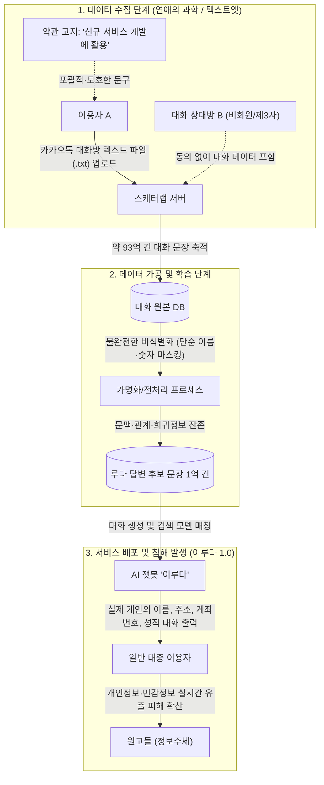

## 1. 들어가며: "내 연인과의 은밀한 대화가 챗봇의 입에서 나왔다"

2020년 12월, 스타트업 스캐터랩(ScatterLab)이 출시한 20대 여성 페르소나의 인공지능(AI) 챗봇 **‘이루다’**는 출시 3주 만에 약 80만 명의 이용자를 모으며 폭발적인 화제를 모았습니다. 그러나 그 인기는 순식간에 악몽으로 바뀌었습니다.

이루다와 대화를 나누던 이용자들의 화면에 실제 살아있는 특정인의 **이름, 거주지 도로명 주소, 계좌번호, 심지어 연인 사이에서만 나눌 법한 성적 은어와 애칭**까지 여과 없이 출력되기 시작한 것입니다. 

확인 결과, 스캐터랩은 자사가 운영하던 연애 심리 분석 서비스인 **'연애의 과학'**과 **'텍스트앳'** 이용자들로부터 수집한 **약 93억 건의 카카오톡 대화 데이터**를 이용자의 명확한 인지나 동의 없이 이루다의 인공지능 학습 데이터베이스(DB)로 전용(轉用)한 것이었습니다.

이 사건은 국내외 테크 업계와 법조계에 커다란 충격을 안겼습니다. *"인공지능을 개발하기 위해서는 방대한 양의 빅데이터가 필수적인데, 약관에 '신규 서비스 개발'이라고 적어두었다면 AI 학습에 써도 되는 것 아닌가?"*라는 테크 기업들의 안일한 데이터 관행에 사법부가 정면으로 칼을 빼든 사건이기 때문입니다.

행정기관인 개인정보보호위원회의 과징금 제재(2021년)에 이어, 2025년 6월 마침내 피해자들이 제기한 **민사 손해배상 집단소송(서울동부지방법원 2021가합104007)**의 1심 판결이 선고되었습니다. 법원은 개발사의 손해배상 책임을 명백히 인정하며 피해자들에게 위자료를 지급하라고 판결했습니다.

AI와 거대언어모델(LLM)이 일상화된 지금, 이 판결은 AI 엔지니어와 데이터 사이언티스트, 그리고 개인정보보호 실무자에게 무엇을 요구하고 있을까요? 판결문 원문과 관련 법령, 기술적 배경을 차근차근 짚어보겠습니다.

---

## 2. 분석 대상 판례 기본 정보

* **사건명**: 손해배상(기)
* **사건번호**: 서울동부지방법원 2021가합104007
* **재판부**: 서울동부지방법원 제15민사부 (재판장 조용래 부장판사)
* **선고일자**: 2025년 6월 12일
* **판결 결과**: 원고 일부 승소 (피해 유형별 위자료 차등 인용)
* **관련 선행 처분**: 개인정보보호위원회 의결 제2021-007-074호 (2021. 4. 28. 과징금 5,550만 원, 과태료 4,780만 원 부과 및 시정명령)
* **판결문 및 사건 정보**: [대법원 대국민서비스 전국법원 주요판결](https://www.scourt.go.kr) 및 각급법원 판례검색 (서울동부지방법원 2021가합104007)

---

## 3. 사건의 경위와 문제가 된 개인정보



### 3.1 사건 발생 과정
1. **카카오톡 대화 원본 수집**: 피고 주식회사 스캐터랩은 2016년부터 유료 서비스인 '연애의 과학'과 '텍스트앳'을 운영했습니다. 연인 간의 카톡 대화 텍스트 파일을 업로드하면 대화 패턴, 답장 시간, 단어 빈도 등을 분석해 상대방의 호감도를 수치로 알려주는 서비스였습니다. 이 과정에서 수집된 카카오톡 대화 문장은 무려 **약 93억 건**에 달했습니다.
2. **사전 학습 및 데이터베이스 구축**: 스캐터랩은 2020년 오픈도메인 대화형 챗봇 '이루다 1.0'을 개발하면서, 연애의 과학에서 수집된 93억 건의 카카오톡 대화 중 약 1억 건을 추출하여 챗봇의 문장 생성 및 응답 후보 데이터베이스(DB)로 탑재·학습시켰습니다.
3. **불완전한 비식별 처리와 실시간 유출**: 스캐터랩은 딥러닝 모델 학습 전 대화 텍스트에서 이름, 전화번호, 주소 등 주요 식별자를 걸러내는 마스킹 작업을 거쳤다고 주장했습니다. 그러나 필터링 알고리즘이 미흡하여 **두 글자 이름, 애칭, 희귀 지명, 직장명, 동·호수가 포함된 상세 주소, 주민등록번호 앞자리, 계좌번호, 비밀번호** 등이 데이터셋에 그대로 남았습니다.
4. **서비스 출시 및 피해 확산**: 2020년 12월 23일 페이스북 메신저를 통해 이루다가 정식 출시되자, 불특정 다수의 이용자가 특정 질문을 던졌을 때 실제 카카오톡 대화 원본에 포함되어 있던 민감한 사생활 정보가 그대로 튀어나왔습니다.
5. **집단소송 제기**: 이에 피해자 수백 명은 스캐터랩이 개인정보보호법을 위반하여 당사자의 동의 없이 데이터를 무단 전용하고 유출시켰다며 2021년 민사 손해배상 청구 소송(서울동부지법 2021가합104007)을 제기했습니다.

### 3.2 문제가 된 개인정보
* **일반 개인정보**: 이름, 닉네임, 생년월일, 휴대전화번호, 거주지 상세 주소, 직장 정보, 계좌번호, 일상적 생활 패턴.
* **민감정보 (법 제23조)**: 연인 간의 은밀한 성생활, 성적 취향, 피임 여부, 성병 및 질병 이력, 종교적 신념, 정치적 견해 등 사생활을 현저히 침해할 우려가 있는 정보.
* **제3자(비회원)의 개인정보**: 연애의 과학 앱을 직접 설치하지도 않고 약관에 동의한 적도 없는 **대화 상대방의 개인정보**가 고스란히 수집·이용됨.

---

## 4. 양측의 핵심 주장과 법원의 판단

### 4.1 원고(이용자 및 피해자)의 주장
1. **명시적 동의 부재 (목적 외 이용)**: 원고들은 '연애 심리 분석'을 위해 카카오톡 대화를 제공했을 뿐, 전혀 다른 서비스인 'AI 챗봇 이루다'의 학습 데이터로 활용되는 것에 동의한 적이 없다.
2. **포괄적 약관 동의의 무효**: 이용약관에 한 줄 적혀 있던 '신규 서비스 개발'이라는 문구는 추상적이고 포괄적이어서, 내 사적인 대화가 불특정 다수와 대화하는 챗봇의 입으로 출력될 것이라고는 전혀 예측할 수 없었다.
3. **민감정보의 별도 동의 위반**: 카톡 대화에는 헌법상 사생활의 핵심 영역인 성생활, 건강 등의 민감정보가 포함되어 있음에도 법 제23조에 따른 별도의 명시적 동의를 받지 않았다.
4. **탈퇴자 정보 미파기**: 회원 탈퇴를 했거나 1년 이상 서비스를 이용하지 않은 회원의 개인정보를 파기하지 않고 AI 모델에 그대로 사용했다.

### 4.2 피고(스캐터랩)의 주장
1. **약관 동의의 유효성**: 서비스 가입 당시 개인정보 처리방침에 '신규 서비스 개발 및 마케팅 활용'을 명시하고 동의를 받았으므로, AI 챗봇 개발은 적법한 이용 범위 내에 있다.
2. **가명정보의 과학적 연구 활용 (법 제28조의2)**: 2020년 개정된 개인정보보호법에 따라, 개인 식별 요소를 제거한 '가명정보'는 통계 작성, 과학적 연구, 공익적 기록 보존 등을 위해 **정보주체의 동의 없이도 처리할 수 있다**. 자연어 처리(NLP) 인공지능 모델 연구개발은 '과학적 연구'에 해당한다.
3. **적절한 비식별화 조치**: 사전에 정규식과 알고리즘을 통해 식별 가능한 개인정보를 필터링하였으므로 고의적인 유출이 아니며 기술적 한계에 불과하다.

---

### 4.3 법원의 판단 및 핵심 판결문 문구

서울동부지방법원은 피고 스캐터랩의 주장을 조목조목 배척하고, **피고의 고의·과실에 의한 불법행위 및 개인정보보호법 위반을 인정하여 원고들에게 위자료를 지급하라**고 판결했습니다.

#### 1) '신규 서비스 개발' 문구는 실질적 동의가 아니다 (동의 원칙 위반)
재판부는 개인정보보호법 제15조 제1항 제1호 및 제22조가 요구하는 '명확하고 실질적인 동의'의 기준을 강조했습니다.

> *"개인정보의 처리에 대한 정보주체의 동의는 정보주체가 자신의 개인정보가 어떠한 목적으로, 어떠한 범위에서 수집·이용되는지 충분히 이해하고 자발적으로 부여한 것이어야 한다.*  
> *피고의 개인정보 처리방침에 **'신규 서비스 개발'이라는 포괄적이고 추상적인 문구가 기재되어 있었다 하더라도, 원고들이 제공한 사적인 대화 내용이 전혀 다른 성격의 오픈도메인 AI 챗봇의 학습 데이터로 사용되어 불특정 다수에게 노출될 수 있다는 점까지 예상하여 동의하였다고 볼 수 없다.**"*

#### 2) 영리 목적의 상용 챗봇 개발은 '과학적 연구'가 아니다 (가명정보 특례 배척)
스캐터랩이 가장 강력하게 내세웠던 '가명정보의 과학적 연구 특례(제28조의2)' 항변에 대해 법원은 단호하게 선을 그었습니다.

> *"피고가 진행한 인공지능 챗봇 '이루다' 개발은 일반 대중을 상대로 유료화 및 상업적 수익 창출을 도모하기 위한 서비스 구축의 일환이지, **순수한 학술적·이론적 진보를 위한 '과학적 연구'의 범주로 포섭하기 어렵다.**"*  
> *"나아가 피고가 취한 비식별 조치는 대화 맥락과 결합할 경우 여전히 특정 개인을 알아볼 수 있는 상태에 머물러 있었으므로, **적법하게 안전성이 확보된 가명정보의 처리라고 평가할 수도 없다.**"*

#### 3) 민감정보 수집에 대한 별도 동의 위반 (법 제23조 위반)
> *"원고들이 연애 심리 분석을 위해 업로드한 카카오톡 대화 내용에는 성생활, 성적 취향, 신체적·정신적 건강 상태 등에 관한 내밀한 정보가 다수 포함되어 있다. 이는 개인정보 보호법 제23조가 특별히 보호하는 '민감정보'에 해당함에도, **피고는 이에 관하여 다른 개인정보와 구분하여 별도의 동의를 받지 아니하였으므로 위법하다.**"*

#### 4) 손해배상(위자료)의 인정 및 차등 지급 명령
법원은 정보주체의 개인정보자기결정권 침해로 인한 정신적 고통을 인정하고, 피해의 중대성에 따라 위자료를 차등 산정하였습니다.
* **일반 개인정보 유출 피해자**: 1인당 **10만 원**
* **민감정보(성생활, 건강 등) 유출 피해자**: 1인당 **30만 원**
* **개인정보와 민감정보가 모두 유출된 피해자**: 1인당 **40만 원**

---

## 5. 1심 판결의 쟁점별 비교 및 법 개정 후 영향 분석

### 5.1 쟁점별 판단 구조 비교

| 쟁점 항목 | 피고(스캐터랩) 주장 | 법원의 최종 판단 |
| :--- | :--- | :--- |
| **약관 동의의 범위** | "신규 서비스 개발" 약관에 동의했으므로 AI 학습 이용은 적법함 | **불인정**. 수집 목적과 완전히 다른 AI 챗봇 학습 전용은 예측 불가능하며, 실질적 동의가 없음 |
| **가명정보 특례 적용 여부** | 비식별화된 데이터이며 NLP 기술 진보를 위한 '과학적 연구'에 해당함 | **불인정**. 상업용 서비스 개발은 법 제28조의2의 과학적 연구로 볼 수 없고, 가명화 수준도 미흡함 |
| **민감정보 처리 여부** | 일상 대화 텍스트일 뿐 의도적으로 민감정보를 수집한 것이 아님 | **위법 인정**. 대화 내에 성생활·건강 등 민감정보가 명백히 포함되어 있으며, 법정 별도 동의 절차를 누락함 |
| **제3자 대화자 정보** | 회원이 자발적으로 업로드한 파일이므로 플랫폼 책임이 제한됨 | **위법 인정**. 비회원 상대방의 동의 없는 개인정보 수집·이용에 대한 관리적 책임을 면할 수 없음 |

### 5.2 사건 이후 법 개정과 현재 시점 기준의 재검토

이 사건 발생 이후 대한민국 개인정보보호 법제는 거대한 변화를 겪었습니다.

```
2020. 08. 데이터 3법 시행 (가명정보 제도 최초 도입)
       ▼
2021. 04. 개인정보보호위원회, 스캐터랩에 과징금·과태료 부과 처분
       ▼
2023. 09. 개정 개인정보 보호법 전면 시행 (온·오프라인 특례 일원화, 동의 제도 유연화)
       ▼
2024~2025 개인정보위, 「인공지능(AI) 개발·서비스를 위한 개인정보 처리 안내서」 발표
       ▼
2025. 06. 서울동부지방법원 민사 손해배상 판결 선고 (2021가합104007)
```

#### 현재(2026년 기준) 현행법으로 다시 판단한다면?
1. **제15조 제1항 제6호 (정당한 이익) 조항의 신설**:
   * 2023년 개정법에서는 계약 체결이나 동의 없이도 '개인정보처리자의 정당한 이익을 달성하기 위하여 필요한 경우' 개인정보를 처리할 수 있는 일반 근거가 마련되었습니다.
   * 그러나 개인정보보호위원회의 2024~2025년 가이드라인에 따르면, **"정보주체의 사적 영역에 속하는 비공개 메신저 대화 내용을 동의 없이 AI 학습에 사용하는 것은 정보주체의 권리 침해 위험이 사업자의 정당한 이익보다 현저히 크므로 허용되지 않는다"**고 명시하고 있습니다.
2. **가명정보 제28조의2 과학적 연구의 범위 구체화**:
   * 현행법 및 해설서에서도 산업적 R&D를 과학적 연구의 범주에 포함하려는 논의가 일부 진전되었으나, **"비공개 대화록을 당초 동의 범위를 벗어나 상업적 챗봇의 문장 데이터베이스로 구축하는 행위"**는 여전히 목적 외 이용 금지(제18조)에 걸립니다.
3. **결론**: 따라서 **현재 개정된 법률과 최신 AI 처리 기준을 적용하더라도 스캐터랩의 행위는 예외 없이 위법하며, 동일하게 손해배상 책임이 성립**합니다.

---

## 6. 참고 문헌 및 공적 자료 (References)

본 분석은 아래의 공적 기관 결정문, 언론 보도, 법률 전문가 해설을 교차 검토하여 작성되었습니다.

1. **공식 의결서**:
   * 개인정보보호위원회, [「주식회사 스캐터랩에 대한 시정명령 및 과징금·과태료 부과처분」 의결서(제2021-007-074호)](https://www.pipc.go.kr), 2021. 4. 28.
2. **언론 보도**:
   * 중앙일보, [「'이루다' 개발사 스캐터랩, 카카오톡 대화 무단 학습 배상 판결…1인당 최대 40만원」](https://www.joongang.co.kr), 2025. 6. 12.
   * 법률저널 / 대한변협신문, [「AI 학습 데이터와 개인정보의 경계…서울동부지법 '이루다' 민사 판결의 시사점」](https://www.koreanbar.or.kr), 2025. 7.
3. **학술 논문 및 실무 지침**:
   * 개인정보보호위원회, [「인공지능(AI) 개발·서비스를 위한 개인정보 처리 안내서」](https://www.privacy.go.kr), 2024.
   * 한국인터넷진흥원(KISA), 「생성형 AI 시대의 개인정보 비식별 조치 및 프라이버시 보호 기술 동향 보고서」, 2025.

---

## 7. 판결에 대한 본인의 평가와 실무 컴플라이언스 수칙

### 7.1 판결에 대한 평가: "인간의 사생활은 AI 발전의 불쏘시개가 아니다"

나는 이번 서울동부지방법원의 판결에 **전적으로 동의하며, 기술 윤리적 관점에서도 매우 기념비적인 판결**이라고 평가한다.

AI 혁신이라는 미명 아래, 많은 테크 기업들이 *"데이터는 다다익선(多多益善)"*이라는 기조로 데이터를 긁어모아 왔다. 특히 웹상의 공개 데이터뿐만 아니라, 특정 서비스를 위해 이용자가 신뢰를 바탕으로 제공한 '내밀한 사적 대화'까지 슬그머니 약관 한 줄로 포섭하려 한 관행은 **'디지털 기만행위(Dark Pattern)'**에 다름 아니었다.

만약 법원이 "신규 서비스 개발이라는 약관 동의가 있었으니 AI 학습은 무죄"라거나 "가명처리했으니 과학적 연구"라는 피고의 항변을 받아들였다면, 대한민국 국민의 모든 금융 거래내역, 의료 상담 챗봇 기록, 메신저 대화는 기업들의 LLM 파인튜닝용 무료 데이터로 전락했을 것이다.

이번 판결은 **"기술의 진보가 헌법 제17조가 보장하는 사생활의 비밀과 자유, 그리고 개인정보자기결정권이라는 인간 존엄의 가치를 앞설 수 없다"**는 대원칙을 사법적으로 재확인해 준 중대한 이정표다.

---

### 7.2 AI 개발팀과 보안/개인정보 실무자가 지켜야 할 4대 황금률

본 판결을 거울삼아, AI 서비스 기획자·개발자·개인정보보호 책임자(CPO)는 다음과 같은 컴플라이언스 체계를 즉각 구축해야 한다.

```
[AI 데이터 파이프라인 컴플라이언스 체크리스트]

1. 데이터 수집 단계  ──▶  AI 학습 목적의 "명시적·개별적 동의" 분리 취득
2. 전처리 정제 단계  ──▶  단순 규칙 기반을 넘어선 "문맥형 NER 비식별화" 적용
3. 민감정보 필터링   ──▶  성생활, 병력, 신념 등 민감정보 사전 탐지 및 즉시 드롭(Drop)
4. 라이프사이클 관리 ──▶  회원 탈퇴 시 모델 파인튜닝 가중치 및 RAG 인덱스 파기 체계 수립
```

#### ① '포괄적 동의'의 환상을 버려라 (목적의 구체화)
약관에 '서비스 개선', '신규 AI 모델 개발'과 같이 추상적인 문구만 기재하는 것은 법적 효력이 없다. 이용자에게 **"당신의 데이터가 대화형 AI 챗봇의 학습 및 답변 생성 데이터베이스로 구축되어 제3자에게 출력될 수 있다"**는 점을 명확히 알리고 선택 동의(Opt-in)를 받아야 한다.

#### ② 단순 마스킹은 가명화가 아니다 (문맥 재식별 방지)
정규식(Regex)으로 전화번호나 3글자 이름을 가리는 것만으로는 부족하다. 대화 문맥 속의 고유한 별명, 직장 동료와의 관계, 특정 사건의 발생 일시가 결합하면 당사자는 쉽게 재식별된다. 따라서 AI 기반의 개체명 인식(NER) 기술과 차분 프라이버시(Differential Privacy) 등 고도화된 프라이버시 보호 기법을 데이터 파이프라인에 필수 적용해야 한다.

#### ③ 민감정보(법 제23조) 수집을 원천 차단하는 필터링 파이프라인 구축
일상 대화나 텍스트 데이터셋에는 이용자가 의도치 않게 입력한 성적 지향, 병력, 종교적 신념 등이 무조건 포함된다. 이러한 데이터가 모델 가중치에 임베딩되거나 벡터 DB에 저장되지 않도록 데이터 수집 인제스천(Ingestion) 단계에서 **민감정보 탐지·삭제(Drop) 필터링 모델**을 반드시 가동해야 한다.

#### ④ 머신러닝 모델의 '잊힐 권리' (Machine Unlearning) 대비
회원이 탈퇴하거나 동의를 철회했을 때 원본 DB에서만 행(Row)을 삭제하고, 이미 학습된 모델 파라미터나 검색 증강 생성(RAG) 인덱스는 그대로 둔다면 법 위반 위험이 남는다. 모델 학습 데이터셋의 버저닝(Versioning)을 철저히 하고, 필요시 특정 이용자의 기여분을 모델에서 소거할 수 있는 **머신 언러닝(Machine Unlearning) 및 데이터 정제 아키텍처**를 사전에 설계해야 한다.

---

> **[맺음말]**  
> "윤리 없는 기술은 통제되지 않는 위험이다."  
> 스캐터랩 이루다 판결은 데이터 기반 비즈니스를 영위하는 모든 테크 기업에게 가장 강력하고 엄중한 경고장을 던졌다. 앞으로의 AI 경쟁력은 단순히 파라미터 크기나 벤치마크 점수뿐만 아니라, **'얼마나 안전하고 윤리적인 데이터 거버넌스를 갖추었는가'**에서 결정될 것이다.
