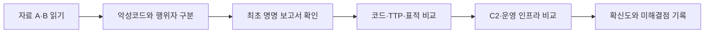
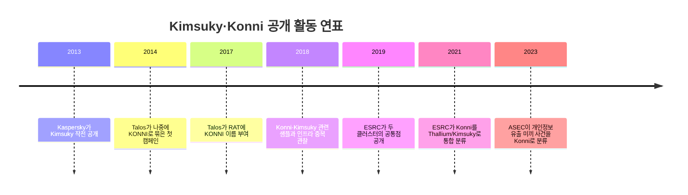

## 1. 들어가며

이번 미션은 두 보안 보고서에 등장하는 공격자를 각각 찾아낸 뒤, 최초로 이름이 붙은 자료와 두 집단의 관계를 추적하는 위협 인텔리전스 입문 과제다.

- 자료 A: Huntress, [Targeted APT Activity: BABYSHARK Is Out for Blood](https://www.huntress.com/blog/targeted-apt-activity-babyshark-is-out-for-blood)
- 자료 B: AhnLab ASEC, [개인정보 유출 관련 내용으로 위장한 피싱 메일 유포 (Konni)](https://asec.ahnlab.com/ko/59625/)

먼저 결론부터 쓰면 자료 A의 P는 **Kimsuky(김수키)**, 자료 B의 Q는 **Konni(코니)**다. 다만 조사하면서 가장 먼저 부딪힌 문제는 이름이었다. KONNI는 처음부터 공격 조직 이름이 아니었고, BABYSHARK도 행위자 이름이 아닌 악성코드 이름이었다.

따라서 단순히 이름을 검색해 같은 그룹이라고 결론 내리지 않고 다음 순서로 자료를 확인했다.



## 2. 자료 A의 공격자 P: Kimsuky


_자료 A 원문. 북한 관련 싱크탱크를 겨냥한 BABYSHARK 침해사고를 다룬다._

Huntress가 조사한 사건은 핵·국가안보 관련 싱크탱크를 겨냥한 북한 연계 사이버 첩보 활동이다. 공격자는 실제 미국의소리(VOA) 관계자인 것처럼 접근해 먼저 대화를 나눴다. 신뢰를 얻은 뒤 “수정본”이라며 암호가 걸린 ZIP과 매크로 포함 Word 문서를 보냈다.

감염 후에는 다음 행위가 이어졌다.

- VBScript와 예약 작업으로 지속성 유지
- 레지스트리에 난독화된 스크립트 저장
- Google Drive와 OneDrive를 페이로드 전달에 악용
- `certutil`을 이용한 데이터 인코딩과 유출
- OneDrive의 `version.dll` 로딩을 이용한 DLL 하이재킹
- `johnbegin`과 `johnend` 사이에 암호화된 데이터를 저장
- 특정 사용자 이름에서만 실행되도록 제한

Huntress 원문은 행위자를 곧바로 Kimsuky라고 단정하지 않고 “북한 국가 지원 행위자”와 BABYSHARK 악성코드로 설명한다. BABYSHARK를 처음 공개한 [Palo Alto Networks Unit 42 보고서](https://unit42.paloaltonetworks.com/new-babyshark-malware-targets-u-s-national-security-think-tanks/)도 KimJongRAT·STOLEN PENCIL과의 연결 및 자원 공유 가능성을 제시했을 뿐, 당시 본문에서 Kimsuky라는 이름을 직접 쓰지는 않았다.

현재 [MITRE ATT&CK의 Kimsuky 항목](https://attack.mitre.org/groups/G0094/)은 BABYSHARK를 Kimsuky가 사용하는 소프트웨어로 분류한다. 자료 A의 표적, 사회공학 방식, 악성코드 계보와 이 후대 분류를 함께 고려해 P를 **Kimsuky**로 식별했다.


_MITRE ATT&CK은 Kimsuky를 G0094로 관리하며 여러 연구사의 별칭을 함께 제시한다._

## 3. Kimsuky라는 이름은 어디에서 왔나

공개적으로 Kimsuky라는 이름을 사용한 초기 원전은 Kaspersky가 2013년 9월 11일 공개한 [The “Kimsuky” Operation: A North Korean APT?](https://securelist.com/the-kimsuky-operation-a-north-korean-apt/57915/)다.


_2013년 Kaspersky의 최초 Kimsuky 보고서. 당시부터 한국의 싱크탱크가 핵심 표적이었다._

Kaspersky가 확인한 표적은 세종연구소, 한국국방연구원, 통일부, 현대상선과 통일 관련 단체 등이었다. 악성코드는 키로깅, 디렉터리 목록 수집, HWP 문서 탈취, 원격 제어 모듈 설치 기능을 갖췄다. C2 통신에는 불가리아 공개 메일 서비스인 `mail.bg`를 사용했으며, 변조한 TeamViewer도 원격 제어 도구로 이용했다.

이름의 직접적인 단서는 드롭박스용 Hotmail 계정 등록명이었다.

```text
iop110112@hotmail.com -> kimsukyang
rsh1213@hotmail.com   -> Kim asdfa
```

Kaspersky는 이 등록명이 실제 공격자 이름이라고 확신할 수 없으며, 조사자를 북한 방향으로 유도하기 위한 정보일 수도 있다고 명시했다. 즉 **Kimsuky라는 이름의 출발점과 북한 귀속 판단은 서로 다른 수준의 증거**다.

북한 연계 판단에는 다음 정보가 함께 사용됐다.

- 한국어가 포함된 컴파일 경로 `D:\rsh공격\UAC_dll(완성)\Release\test.pdb`
- 외교·국방·통일 정책과 관련된 한국 기관 중심의 피해자 구성
- 중국 지린성·랴오닝성 대역에서 관찰된 운영 IP 10개
- HWP 문서와 AhnLab 제품 등 한국 환경에 특화된 기능

최초 보고서가 등록명 하나로 배후를 확정하지 않고 반증 가능성까지 남긴 점이 인상적이었다.

## 4. 자료 B의 공격자 Q: Konni


_자료 B 원문. 개인정보 유출 자료로 위장한 실행 파일을 Konni 그룹의 공격으로 분류했다._

ASEC은 개인정보 유출 관련 자료로 위장한 악성 EXE가 개인을 대상으로 유포된 사건을 **Konni 공격 그룹**의 활동으로 분류했다. 악성 파일을 실행하면 `.data` 섹션의 구성 요소가 `%ProgramData%` 아래에 생성된다. 이후 C2에서 난독화된 명령을 받아 XML 형식으로 실행하는 백도어로 동작한다.

당시에는 C2가 닫혀 있어 ASEC이 최종 행위까지 확인하지 못했다. 따라서 이 사례의 귀속은 공격 전 과정을 실시간으로 지켜본 결과라기보다 확보한 악성코드, 실행 흐름과 과거 Konni 지표를 비교해 같은 활동 묶음으로 판단한 결과로 이해했다.

## 5. KONNI라는 이름을 처음 붙인 자료

KONNI라는 이름을 처음 붙여 공개한 원전은 Cisco Talos가 2017년 5월 3일 작성한 [KONNI: A Malware Under The Radar For Years](https://blog.talosintelligence.com/konni-malware-under-radar-for-years/)다. 보고서에는 “Talos has named this malware KONNI”라고 명시되어 있다.


_KONNI라는 이름을 붙인 2017년 Cisco Talos 보고서. 분류도 그룹이 아니라 RAT이다._

여기서 중요한 점은 **KONNI가 처음에는 공격 조직명이 아니라 RAT 악성코드 이름이었다**는 것이다. [MITRE ATT&CK도 KONNI를 그룹이 아닌 Software S0356](https://attack.mitre.org/software/S0356/)으로 등록하고 있다.

Talos는 2014년부터 2017년까지의 네 캠페인을 비교했다.

| 시기 | 관찰 내용 |
|---|---|
| 2014 | 키 입력, 클립보드, 브라우저 프로필·쿠키를 훔치는 정보 탈취 도구 |
| 2016 | EXE와 DLL로 구조가 분리되고 업로드·다운로드·명령 실행 기능 추가 |
| 2017 | 화면 캡처, 시스템 정보 수집을 포함한 RAT 기능 확장 |

공통적으로 이메일 첨부파일과 `.scr` 실행 유도, 미끼 문서 표시를 사용했다. 인프라는 무료 웹호스팅인 `000webhost`를 이용했고, 2017년 미끼 문서에는 UN·UNICEF·대사관 등 북한 관련 기관의 연락처가 들어 있었다.

Talos는 당시 운영자의 국가나 기존 APT 그룹을 확정하지 않았다. 이후 보안업체들이 KONNI 악성코드를 사용하는 캠페인과 운영자 클러스터를 “Konni Group”으로 부르면서 악성코드명과 행위자명이 겹치게 됐다.

## 6. Kimsuky와 Konni를 연결하는 증거

둘의 관계를 가장 구체적으로 다룬 공개 자료는 이스트시큐리티 ESRC가 2019년에 발표한 [APT 캠페인 'Konni' & 'Kimsuky' 조직의 공통점 발견](https://www.estsecurity.com/enterprise/security-center/notice/view/434)이다.


_두 클러스터의 코드·도구·인프라 중복을 분석한 ESRC 보고서._

### 6.1 악성코드 구현의 중복

ESRC가 Konni와 Kimsuky의 Cobra Venom 계열 샘플을 비교했을 때 다음 항목이 겹쳤다.

| 구분 | 관찰된 연결점 | 판단 |
|---|---|---|
| 파일명 | `ChromSrch.dat` 동일 | 단독으로는 약한 증거 |
| 압축 | 암호화 압축과 설정 암호가 일치 | 강한 증거 |
| 바이너리 | `EngineDropperDll.dll` 익스포트명 일치 | 강한 증거 |
| 실행 인자 | `insrchmdl` 파라미터 일치 | 강한 증거 |
| 암호화 | 데이터 복호화 루틴 일치 | 매우 강한 증거 |
| 최종 페이로드 | `Gongstrong` 문자열의 커스텀 TeamViewer | 매우 강한 증거 |

파일명 하나는 누구나 복사할 수 있다. 그러나 같은 파일명과 압축 암호, 익스포트 함수, 인자, 복호화 구현, 최종 페이로드가 한꺼번에 겹친다면 우연일 가능성은 훨씬 낮아진다.

특히 커스텀 TeamViewer가 눈에 띄었다. 2013년 Kaspersky 보고서의 Kimsuky도 변조 TeamViewer를 사용했다. ESRC는 Konni 계열 Babyface RAT의 후속 단계와 Kimsuky HWP 공격에서 `Gongstrong` 문자열이 있는 같은 계열의 커스텀 TeamViewer가 사용됐고, 최종 페이로드 기능도 일치한다고 분석했다.

### 6.2 공격 방식과 표적의 중복

두 클러스터에서 반복된 특징은 다음과 같다.

- 표적형 이메일과 관계 형성형 사회공학
- 북한·통일·외교·국방·인권 분야 관계자 표적화
- 정상 문서를 보여 주면서 백그라운드에서 악성코드 실행
- Word·HWP·스크립트·DLL을 조합한 다단계 감염
- 탈취한 웹사이트 또는 무료 호스팅을 유포지와 C2로 사용
- 한국어 환경과 국내 웹 생태계에 대한 높은 이해
- 암호화폐 분야로 공격 범위 확대

표적과 TTP가 비슷하다는 사실만으로 같은 팀이라고 할 수는 없다. 같은 국가의 여러 팀이 임무나 교육 자료, 공개 도구를 공유할 수 있기 때문이다. 이 항목은 코드와 인프라 증거를 보조하는 정황으로 보았다.

### 6.3 인프라와 운영 흔적

ESRC 보고서에는 더 직접적인 연결점도 등장한다.

| Konni | Kimsuky | 연결 내용 |
|---|---|---|
| `naoei3-tosma.96[.]lt` | `naver-security-mail.96[.]lt` | 같은 무료 호스팅 계열과 유사 작명 |
| `naiei-aldiel.16mb[.]com` | `carolie-svr-v1.16mb[.]com` | 같은 호스팅 도메인 사용 |
| `upgradesrv.890m[.]com` | `oeks39402.890m[.]com` 등 | 같은 호스팅 계열 |
| `202.168.155[.]156` | `202.168.155[.]156` | 운영 IP가 정확히 일치 |

그 밖에도 Kimsuky C2에서 같은 `b374k` 웹셸, `victory` 계열 비밀번호와 PHP 메일 발송 도구가 반복됐다. Konni 문서에서 쓰인 `filer1.1apps[.]com` C2도 다른 연결 캠페인에서 재사용됐다.

IP 하나나 무료 호스팅 업체 하나가 겹치는 것은 공유 VPN, 감염 서버, 호스팅 재판매 때문에 생길 수 있다. 하지만 코드·암호·커스텀 도구·인프라가 동시에 겹친다면 동일 운영 생태계를 가리킬 가능성이 높다.

### 6.4 활동 시기와 분류 변화



ESRC는 2021년 [코니(Konni)조직을 탈륨(Thallium)으로 통합 분류](https://direct.estsecurity.com/public/security-center/notice/view/14394?category-id=6)한다고 발표했다. Thallium은 당시 Microsoft가 사용한 Kimsuky 계열 명칭이다.

그러나 모든 연구기관이 완전히 같은 분류를 사용하지는 않는다. MITRE의 [KONNI 항목](https://attack.mitre.org/software/S0356/)은 북한 연계 캠페인과 NOKKI 코드 중복을 설명하면서 APT37 연결 가능성도 함께 남긴다. 같은 샘플을 어느 범위의 그룹으로 묶을지는 연구사가 가진 가시성과 분류 기준에 따라 달라질 수 있다.

## 7. 최종 판단

내 결론은 다음과 같다.

> **Konni는 Kimsuky와 완전히 무관한 별도 조직이라기보다, Kimsuky와 개발·도구·인프라를 공유한 하위 클러스터 또는 같은 운영 생태계의 활동 묶음일 가능성이 높다.** 다만 공개 자료만으로 “언제나 동일한 사람들이 수행한 하나의 팀”이라고 단정하기는 어렵다.

확신도를 나누면 다음과 같다.

| 판단 | 확신도 | 이유 |
|---|---|---|
| 두 활동 모두 북한 연계 | 높음 | 장기간 반복된 표적·언어·작전 목적과 다수 기관 분석 |
| Kimsuky와 Konni 사이 운영 연계 | 중간~높음 | 코드·암호·커스텀 도구·C2·IP 중복 |
| 두 이름이 항상 동일한 단일 팀 | 낮음~중간 | 업체별 분류 차이, KONNI가 원래 악성코드명이라는 문제 |

따라서 `Kimsuky = Konni`라고 간단히 등호를 긋기보다 **관측 시기와 연구사에 따라 경계가 달라지는 중첩 클러스터**라고 표현하는 것이 가장 정확하다고 생각한다.

## 8. 조사하면서 새로 알게 된 점

### 악성코드명과 행위자명은 다르다

KONNI는 RAT 이름에서 출발했고, BABYSHARK 역시 악성코드 이름이다. 특정 악성코드가 발견됐다는 사실과 그 실행 주체를 확정하는 것은 별개의 분석 단계다.

### APT 이름은 고정된 주민등록번호가 아니다

Kimsuky, Thallium, Emerald Sleet, APT43 같은 이름은 연구기관이 자기 텔레메트리에서 본 활동을 묶은 라벨이다. 이름이 다르다고 반드시 다른 사람이 아니며, 이름이 같다고 모든 사건의 운영자가 같다는 보장도 없다.

### 단일 IOC보다 증거의 결합이 중요하다

미끼 주제와 표적은 쉽게 따라 할 수 있다. IP도 VPN이나 침해 서버일 수 있다. 반면 고유 코드 루틴, 커스텀 도구, 압축 암호, 인프라와 활동 시간이 함께 연결되면 귀속 판단은 훨씬 강해진다.

### 최초 보고서는 후대의 요약보다 신중했다

Kaspersky와 Talos는 당시 확인할 수 있는 사실과 추정을 분리했다. 시간이 지나 여러 업체의 관측이 쌓이면서 현재의 그룹 분류가 형성됐다. 위협 인텔리전스는 한 번의 검색 결과가 아니라 새로운 증거로 계속 수정되는 분석 과정이었다.

## 9. 아직 답을 찾지 못한 점

- Cisco Talos가 왜 `KONNI`라는 단어를 선택했는지는 최초 보고서에 설명되어 있지 않았다.
- 겹친 코드와 인프라가 동일 운영자 때문인지, 북한 내 공용 개발팀·도구 공급망·인프라 관리 조직 때문인지는 공개 자료만으로 구분하기 어렵다.
- ESRC가 제시한 일부 연결은 원본 샘플과 전체 서버 로그가 공개되지 않아 모든 분석을 제3자가 독립적으로 재현하기 어렵다.
- Konni를 Kimsuky가 아닌 APT37 쪽과 연결하는 분류의 차이를 해소하려면 같은 기간의 원본 샘플, 피해자 중복, 도메인 등록·접속 이력을 더 비교해야 한다.

## 10. 마무리

이번 조사에서 가장 큰 교훈은 **위협 행위자를 찾는 일이 이름 맞히기가 아니라는 것**이었다. 보고서가 사용한 명칭이 악성코드인지, 캠페인인지, 운영자 클러스터인지 먼저 구분해야 했다. 그 다음 코드, TTP, 피해자, 인프라와 시간 정보를 함께 비교하고, 증거마다 신뢰도를 다르게 매겨야 했다.

Kimsuky와 Konni의 경우 공개 증거는 강한 운영 연계를 가리킨다. 하지만 위협 인텔리전스에서 “연결됐다”와 “완전히 동일하다”는 같은 말이 아니다. 확인된 사실과 분석자의 추정을 분리하고, 아직 설명하지 못한 부분을 남기는 것이 성급한 단정보다 좋은 결론이라고 생각한다.

### 참고 자료

- Huntress, [Targeted APT Activity: BABYSHARK Is Out for Blood](https://www.huntress.com/blog/targeted-apt-activity-babyshark-is-out-for-blood)
- AhnLab ASEC, [개인정보 유출 관련 내용으로 위장한 피싱 메일 유포 (Konni)](https://asec.ahnlab.com/ko/59625/)
- Kaspersky Securelist, [The “Kimsuky” Operation: A North Korean APT?](https://securelist.com/the-kimsuky-operation-a-north-korean-apt/57915/)
- Cisco Talos, [KONNI: A Malware Under The Radar For Years](https://blog.talosintelligence.com/konni-malware-under-radar-for-years/)
- Palo Alto Networks Unit 42, [New BabyShark Malware Targets U.S. National Security Think Tanks](https://unit42.paloaltonetworks.com/new-babyshark-malware-targets-u-s-national-security-think-tanks/)
- ESTsecurity ESRC, [APT 캠페인 'Konni' & 'Kimsuky' 조직의 공통점 발견](https://www.estsecurity.com/enterprise/security-center/notice/view/434)
- ESTsecurity ESRC, [코니(Konni)조직을 탈륨(Thallium)으로 통합 분류](https://direct.estsecurity.com/public/security-center/notice/view/14394?category-id=6)
- MITRE ATT&CK, [Kimsuky (G0094)](https://attack.mitre.org/groups/G0094/)
- MITRE ATT&CK, [KONNI (S0356)](https://attack.mitre.org/software/S0356/)
