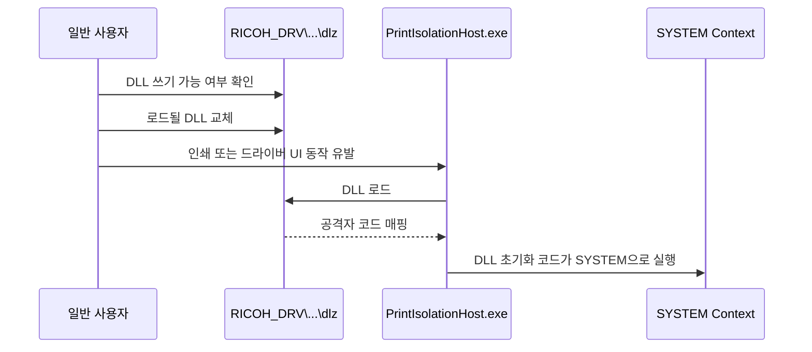

## 1. 시작하며

이번에 한것은 Ricoh Windows Printer Driver에서 발견된 로컬 권한 상승 취약점 **CVE-2019-19363**을 분석하는 것이다.

처음에는 프린터 드라이버 취약점이라 커널 드라이버나 메모리 손상을 예상했다. 하지만 원인은 단순, 치명적이었다. 일반 사용자가 바꿀 수 있는 DLL을 SYSTEM 권한의 프로세스가 그대로 불러왔다. 결국 파일 권한 하나가 Windows의 권한 경계를 무너뜨렸다.

이번 분석에서는 다음 순서로 살펴보았다.

```text
Windows 인쇄 구조 조사
→ 취약 드라이버와 ACL 확인
→ 공개 PoC의 권한 상승 흐름 분석
→ 무해한 ACL 모형으로 조건 검증
→ 패치·탐지·대응 방안 정리
```

운영 중인 Windows PC에서 취약 드라이버나 공개 PoC를 실행하지 않았다. 공개 권고문에 나타난 취약 ACL은 격리된 디렉터리에서만 확인했고, 공격 흐름은 소스와 기술문서를 기반으로 분석했다.


_JVN : CVE-2019-19363을 로컬 권한 상승 문제로 분류, 제조사가 제공하는 패치 적용을 권고_

## 2. 취약점 요약

| 항목 | 내용 |
|---|---|
| CVE | CVE-2019-19363 |
| 제품 | Ricoh·Savin·Lanier Windows 프린터/PC FAX 드라이버 |
| 취약점 유형 | 잘못된 파일 권한으로 인한 로컬 권한 상승 |
| CWE | CWE-732, Incorrect Permission Assignment for Critical Resource |
| 공격 위치 | Local |
| 필요 권한 | 일반 로컬 사용자 |
| 사용자 상호작용 | 불필요 |
| 최종 영향 | `NT AUTHORITY\SYSTEM` 권한으로 코드 실행 |
| NVD CVSS 3.1 | 7.8 High |

Pentagrid의 최초 권고문은 Scope Changed로 계산한 8.8을 제시한다. 현재 NVD는 Scope Unchanged인 7.8로 평가한다. 점수에는 차이가 있지만, 일반 사용자가 SYSTEM까지 상승해 기밀성·무결성·가용성에 모두 큰 영향을 줄 수 있다는 판단은 같다.

핵심을 한 문장으로 정리하면 다음과 같다.

> 일반 사용자가 수정할 수 있는 Ricoh 드라이버 DLL을 SYSTEM 권한의 `PrintIsolationHost.exe`가 로드하면서 DLL 코드도 SYSTEM 권한으로 실행된다.

## 3. Windows 프린터 드라이버 구조

### 3.1 프린터 드라이버는 무엇을 하는가

응용프로그램이 만든 문서나 그림을 프린터가 곧바로 이해하는 것은 아니다. Windows의 인쇄 구성 요소와 제조사 드라이버가 이를 PCL, PostScript 같은 프린터 언어로 변환한다.


Microsoft 문서에 따르면 Print Spooler는 다음 일을 한다.

- 로컬 또는 네트워크 인쇄 여부 결정
- 프린터 드라이버와 함께 GDI 데이터 처리
- 인쇄 데이터를 스풀 파일에 저장
- 논리적 인쇄 대기열과 실제 프린터 연결
- EMF 데이터를 PCL·PostScript 등으로 변환
- 프린터 드라이버와 관련 구성 요소 관리

여기서 주의할 점은 프린터 드라이버가 사용자 모드에서 동작한다고 해서 낮은 권한인 것은 아니라는 것이다. DLL의 실제 권한은 **그 DLL을 어느 프로세스가 로드했는가**에 따라 결정된다.

### 3.2 PrintIsolationHost.exe

과거에는 제조사 드라이버 DLL을 스풀러 프로세스인 `spoolsv.exe`가 직접 로드했다. 품질이 낮은 드라이버 하나가 충돌하면 인쇄 서비스 전체가 같이 중단될 수 있었다.

Windows 7부터 도입된 Printer Driver Isolation은 드라이버를 별도 프로세스인 `PrintIsolationHost.exe`에서 실행할 수 있게 했다. Microsoft가 설명하는 격리 모드는 다음 세 가지다.

| 모드 | 동작 |
|---|---|
| None | 드라이버가 스풀러 프로세스에서 실행 |
| Shared | 격리 가능 드라이버들이 별도 호스트 프로세스를 공유 |
| Isolated | 드라이버마다 별도 프로세스에서 실행 |

이 기능의 목적은 **안정성 격리**다. 드라이버가 죽어도 스풀러 전체가 죽지 않게 하는 기능이지, DLL의 파일 무결성을 대신 보장하는 샌드박스는 아니다.

`PrintIsolationHost.exe`가 SYSTEM으로 실행 중이고 공격자가 로드될 DLL을 바꿀 수 있다면, 공격자 DLL도 SYSTEM 보안 토큰으로 실행된다.

## 4. 영향받는 드라이버

Ricoh가 2020년 4월 15일 갱신한 공식 목록을 확인했다.


_Ricoh 공식 Printer Security Program 페이지. Universal Print Driver 4.27 이상 사용과 모든 PC에 대한 보안 프로그램 적용을 안내_

| 드라이버 | Ricoh 공식 취약 범위 |
|---|---|
| PCL6 Driver for Universal Print | 4.0–4.26 |
| PS Driver for Universal Print | 4.0–4.26 |
| PC FAX Generic Driver | 9.0–9.5, 10.0–11.3 |
| Generic PCL5 Driver | 1.0–1.3 |
| RPCS Driver | 모델별 상이 |
| PostScript3 Driver | 모델별 상이 |
| PCL6 (PCL XL) Driver | 모델별 상이 |
| RPCS Raster Driver | 모델별 상이 |

NVD의 초기 설명은 일부 제품군을 “all versions”처럼 넓게 표현하지만, 실제 대응 시에는 Ricoh가 이후 갱신한 제품·버전 목록과 각 모델의 다운로드 이력을 우선 확인해야 한다.

브랜드도 Ricoh만 보면 안 된다. 같은 드라이버를 사용하는 **Savin과 Lanier** 제품도 포함된다. Universal Print Driver는 여러 모델에서 재사용되기 때문에 특정 프린터 한 대에만 국한된 문제가 아니다.

## 5. 취약점의 근본 원인

### 5.1 쓰기 가능한 드라이버 DLL

취약한 드라이버를 설치하면 다음과 같은 경로가 만들어질 수 있다.(예시)

```text
C:\ProgramData\RICOH_DRV\<driver-name>\_common\dlz\
C:\ProgramData\RICOH\<driver-name>\_common\dlz\
```

Pentagrid가 Universal Print Driver 4.23을 분석한 결과, 이 경로의 여러 DLL에 다음 권한이 설정되어 있었다.

```text
Everyone:(I)(F)
```

- `I`: 상위 경로에서 상속받은 권한
- `F`: Full Control

`Everyone`에 Full Control이 있으면 일반 사용자도 DLL을 덮어쓰고 삭제하거나 다른 파일로 교체할 수 있다. 프로세스가 실행 코드로 사용하는 파일에 절대 있어서는 안 되는 권한이다.


_최초 공개 권고문은 잘못 보호된 DLL이 SYSTEM 권한의 PrintIsolationHost.exe에 로드된다고 설명_

### 5.2 깨진 보안 불변식

Windows ACL에서 최소한 다음 조건은 지켜져야 한다.

> 프로세스가 실행 코드로 로드하는 파일과 그 상위 디렉터리는 저권한 사용자에게 쓰기·삭제·이름 변경 권한을 주어서는 안 된다.

파일 하나의 `Write` 권한만 확인해서도 안 된다. 부모 디렉터리에 파일 생성·삭제 권한이 있으면 기존 파일을 지우고 같은 이름으로 바꾸는 공격이 가능할 수 있다. 상속 가능한 ACL도 함께 봐야 한다.

이 취약점은 흔히 DLL Hijacking으로 설명되지만 전형적인 DLL search-order hijacking과는 차이가 있다. 검색 순서를 속여 다른 경로의 DLL을 먼저 읽히는 것이 아니라, **정상적으로 지정된 경로의 DLL 자체가 쓰기 가능**했다. 따라서 더 정확한 표현은 `writable privileged DLL` 또는 `insecure file permissions`다.


_AI로 자체 제작한 공격 흐름 도식. 저권한 쓰기와 로드가 만나는 지점이 핵심이다._

## 6. 공개 PoC로 본 공격 흐름

공개 PoC와 Pentagrid 권고문을 정적으로 읽어 공격 과정을 정리했다. 이 글에서는 실행 가능한 공격 코드를 그대로 싣지 않고, 권한 경계가 무너지는 흐름만 설명한다.

### 6.1 전제 조건

공격자에게는 다음 조건이 필요하다.

1. 대상 Windows 호스트의 일반 사용자 계정 또는 동등한 코드 실행 권한
2. 취약한 Ricoh 드라이버가 이미 설치되어 있거나 드라이버를 추가할 수 있는 정책
3. 프린터를 추가하거나 드라이버 동작을 유발할 수 있는 권한
4. `RICOH_DRV` 또는 `RICOH` 하위 DLL에 쓰기 가능한 ACL

따라서 인터넷에서 곧바로 SYSTEM을 얻는 원격 코드 실행 취약점은 아니다. 피싱, 탈취 계정, RDP 세션, 다른 프로그램의 샌드박스 탈출 등으로 이미 확보한 저권한 실행을 SYSTEM으로 확대하는 후속 단계에 가깝다고 생각된다.

### 6.2 단계별 흐름



공개 PoC는 드라이버 DLL의 파일 변경을 감시하다가 적절한 시점에 DLL을 교체한다. 그 뒤 인쇄 관련 동작을 유발하면 `PrintIsolationHost.exe`가 해당 파일을 로드한다.

타이밍이 중요한 이유는 일부 DLL이 `.dlz` 파일에서 풀리거나 드라이버 UI를 열 때 갱신되기 때문이다. 하지만 레이스 컨디션은 악용 구현의 한 부분일 뿐이다. 근본 취약점은 저권한 사용자가 로드 대상을 바꿀 수 있다는 데 있다.

## 7. ACL 조건을 안전하게 검증해 보기

실제 취약 드라이버를 운영 PC에 설치하는 대신, 공개 권고문의 ACL 상태를 무해한 모형 경로에서 재현해 의미를 확인했다.


_공개 권고문의 ACL을 바탕으로 만든 격리 실습 기록. 공격 DLL이나 권한 상승 코드는 사용하지 않았다._

운영 환경에서는 우선 읽기 전용 점검만 수행한다.

```powershell
# 설치된 프린터 드라이버 확인
Get-PrinterDriver |
  Select-Object Name, Manufacturer, DriverVersion, InfPath

# Ricoh 작업 디렉터리 존재 여부 확인
Get-ChildItem 'C:\ProgramData\RICOH_DRV', 'C:\ProgramData\RICOH' `
  -Force -ErrorAction SilentlyContinue

# 상위 디렉터리 ACL 확인
icacls 'C:\ProgramData\RICOH_DRV'
icacls 'C:\ProgramData\RICOH'

# DLL별 ACL 수집
Get-ChildItem 'C:\ProgramData\RICOH_DRV', 'C:\ProgramData\RICOH' `
  -Filter *.dll -Recurse -ErrorAction SilentlyContinue |
  ForEach-Object {
    [pscustomobject]@{
      Path = $_.FullName
      ACL  = (Get-Acl -LiteralPath $_.FullName).AccessToString
    }
  }
```

다음 주체에 `FullControl`, `Modify`, `Write`, `Delete`가 부여돼 있으면 조사 대상으로 분류한다.

- `Everyone`
- `BUILTIN\Users`
- `Authenticated Users`
- 그 밖의 일반 사용자 그룹

`icacls`로 ACL을 임의 수정하면 인쇄 기능이 고장 날 수 있다. Ricoh도 수동 변경 대신 공식 Security Program 또는 수정된 드라이버를 사용하도록 권고한다.

## 8. 패치는 무엇을 바꾸는가

Ricoh의 패치 가이드를 읽어보면 보안 프로그램이 단순히 `Everyone` 항목만 삭제하지 않는다는 점이 중요하다.

1. Windows 드라이버 디렉터리의 `.dlz`에서 원본 DLL을 푼다.
2. `RICOH_DRV` 또는 `RICOH` 하위 `dlz` 폴더의 DLL과 비교한다.
3. 다르면 공식 DLL로 덮어써 무결성을 복원한다.
4. 디렉터리와 파일의 접근 권한을 안전하게 변경한다.

64비트와 32비트 드라이버 원본 위치는 다음과 같이 설명되어 있다.

```text
64-bit: C:\Windows\System32\spool\drivers\x64\3
32-bit: C:\Windows\System32\spool\drivers\W32X86\3
```

파일 복원 단계가 있는 이유는 ACL을 잠그기 전에 이미 변조되었거나 오래된 DLL이 남아 있을 수 있기 때문이다. 변조된 파일에 안전한 ACL만 씌우면 공격자 코드를 보호하는 결과가 될 수 있다.

### 8.1 권장 조치 순서

1. Ricoh·Savin·Lanier 드라이버와 버전을 전 자산에서 식별한다.
2. 가능하면 취약 드라이버와 저장해 둔 구형 설치 파일을 제거한다.
3. Universal PCL6/PS는 **4.27 이상**으로 업데이트한다.
4. 모델별 드라이버는 릴리스 이력에 `Countermeasure for vulnerability “CVE-2019-19363”`가 있는 최신판을 설치한다.
5. 수정된 드라이버가 없다면 **Printer Driver Security Program 1.3.0.0**을 관리자 권한으로 적용한다.
6. 인쇄 서버와 클라이언트 PC 모두 적용한다.
7. 재부팅 후 DLL 무결성과 ACL을 다시 확인한다.


_드라이버 버전만 보지 않고 실제 DLL ACL까지 확인해야 한다._

### 8.2 놓치기 쉬운 점

- Security Program은 기본적으로 Point and Print를 통해 자동 배포되지 않는다.
- 서버만 패치하고 클라이언트를 남겨두면 클라이언트의 취약 DLL은 그대로다.
- Security Program 적용 뒤 취약한 드라이버를 다시 설치하면 프로그램을 다시 실행해야 한다.
- Universal PCL6/PS 4.27에는 보안 프로그램의 자동 실행 버전이 포함돼 있다.
- 4.26 이하는 패치되지 않은 Universal Print Driver다.
- Ricoh 가이드는 이전 보안 프로그램이 아니라 1.3.0.0 사용을 명시한다.

## 9. 임시 완화책

업무 사정으로 즉시 드라이버를 바꾸기 어렵다면 공격 전제를 줄이는 정책을 적용할 수 있다.

- `Devices: Prevent users from installing printer drivers` 활성화
- `Prevent addition of printers` 활성화
- Point and Print를 승인된 서버로 제한
- 비관리자의 프린터 드라이버 설치 제한
- 인쇄 기능이 필요 없는 서버에서 Print Spooler 비활성화
- 가능하면 Microsoft IPP inbox class driver와 현대 인쇄 플랫폼 사용

이 설정은 드라이버 설치나 공격 유발을 어렵게 만들 뿐, 이미 설치된 쓰기 가능한 DLL을 고치지는 않는다. 최종 해결은 최신 드라이버 또는 공식 보안 프로그램 적용이다.

## 10. 탐지 방안

### 10.1 자산과 ACL 기반 탐지

가장 먼저 다음 세 정보를 결합한다.

```text
드라이버 이름·버전
        +
RICOH_DRV / RICOH 경로 존재 여부
        +
DLL 및 부모 디렉터리 ACL
```

취약 버전만으로는 실제 노출 여부를 완전히 알 수 없고, ACL만으로는 어떤 드라이버가 만들었는지 알기 어렵다. 두 정보를 함께 봐야 한다.

### 10.2 Sysmon과 EDR

Sysmon을 사용한다면 다음 이벤트를 연결해서 본다.

| 이벤트 | 확인 내용 |
|---|---|
| Event ID 11, FileCreate | `RICOH_DRV`/`RICOH` 하위 DLL 생성·교체 |
| Event ID 7, ImageLoad | `PrintIsolationHost.exe`가 해당 DLL을 로드 |
| Event ID 1, ProcessCreate | `PrintIsolationHost.exe`의 비정상 자식 프로세스 |
| EDR 파일 이벤트 | DLL 해시·서명·수정 주체·수정 시간 |

특히 다음 시간 순서가 보이면 우선순위를 높인다.

```text
비관리자 프로세스가 Ricoh DLL 수정
→ 수초 내 PrintIsolationHost.exe가 같은 DLL 로드
→ 셸·스크립트 엔진·알 수 없는 자식 프로세스 생성
```

Sigma 아이디어는 다음과 같다. 환경마다 정상 설치 프로그램 경로와 서명 정보를 반영해 튜닝해야 한다.

```yaml
title: Suspicious DLL Write Under Ricoh Driver Data Directory
status: experimental
logsource:
  category: file_event
  product: windows
detection:
  ricoh_path:
    TargetFilename|startswith:
      - 'C:\ProgramData\RICOH_DRV\'
      - 'C:\ProgramData\RICOH\'
    TargetFilename|endswith: '.dll'
  known_installer:
    Image|endswith:
      - '\msiexec.exe'
  condition: ricoh_path and not known_installer
level: high
```

설치와 업데이트 중에도 DLL이 정상 변경되므로 파일 이벤트 하나만으로 공격을 확정하면 오탐이 많다. 사용자 SID, 프로세스 서명, 변경 후 로드, 자식 프로세스를 함께 확인해야 한다.

### 10.3 침해사고 대응

실제 악용이 의심되면 ACL을 바로 고치기 전에 증거부터 보존한다.

1. 호스트를 네트워크에서 격리한다.
2. 메모리와 EDR 텔레메트리를 보존한다.
3. 의심 DLL의 해시, 서명, 소유자, ACL, 타임스탬프를 수집한다.
4. `PrintIsolationHost.exe`의 로드 모듈과 프로세스 트리를 확인한다.
5. 프린터·드라이버 설치 기록과 MSI 이벤트를 시간순으로 재구성한다.
6. SYSTEM 권한 획득 이후의 서비스·예약 작업·계정 변경·자격 증명 접근을 조사한다.
7. 증거 수집 후 신뢰할 수 있는 최신 드라이버로 재설치하고 보안 프로그램을 적용한다.

## 11. 패치 검증 체크리스트

| 점검 항목 | 기대 상태 |
|---|---|
| Universal PCL6/PS | 4.27 이상 |
| 모델별 드라이버 | 릴리스 이력에 CVE 대응 문구 존재 |
| Security Program | 1.3.0.0 적용 |
| 적용 대상 | 인쇄 서버와 모든 클라이언트 |
| `dlz` ACL | `Everyone` 제거, 일반 사용자 쓰기 불가 |
| 부모 디렉터리 ACL | 일반 사용자 생성·삭제·이름 변경 불가 |
| DLL 무결성 | 공식 설치 원본과 일치, 유효한 서명·해시 |
| 취약 드라이버 재설치 | Security Program 재적용 후 재검증 |
| 드라이버 설치 정책 | 비관리자와 비승인 Point and Print 제한 |

## Windows VM에서 실제 재현

공개 자료의 내용이 실제로 재현되는지 확인하기 위해 별도의 Windows VM에서 실습했다. 공격용 DLL이나 SYSTEM 셸은 사용하지 않고, 취약한 ACL과 권한 경계가 연결되는 지점까지만 검증했다.

먼저 Pentagrid 권고문에 명시된 PCL6 Universal Print Driver 4.23 패키지를 Ricoh 공식 서버에서 내려받았다. SHA-256은 공개 권고문의 값과 일치했다.


_다운로드한 `z87179L19.exe`의 SHA-256이 공개된 `064c1db7...d64ab`와 일치했다._

드라이버의 카탈로그 서명이 유효한 것을 확인한 뒤 `RICOH PCL6 UniversalDriver V4.23`을 설치했다.


_Windows Driver Store에 취약 버전인 V4.23이 등록된 상태._

실제 프린터 대신 로컬 테스트 포트를 만들고 드라이버를 연결했다. 프린터를 추가하자 공개 권고문과 동일하게 `C:\ProgramData\RICOH_DRV` 아래에 드라이버 데이터와 DLL이 생성됐다.


_`borderline.dll`, `headerfooter.dll`, `jobhook.dll` 등 실제 취약 대상이 생성됐다._

생성된 `dlz` 디렉터리와 DLL의 ACL을 조회하자 `Everyone`에 `FullControl`이 상속돼 있었다. 공개 권고문에 적힌 취약 상태가 그대로 재현된 것이다.


_디렉터리와 모든 DLL에서 `Everyone / FullControl`을 확인했다._

관리자 계정과 별도로 `cveuser`라는 표준 사용자를 만들었다. Medium Integrity 상태의 이 사용자가 관리자 권한 없이 `dlz` 디렉터리에 증명 파일을 생성할 수 있었다.


_`dlfwo\cveuser`가 `lowpriv-write-proof.txt`를 생성했다. 기존 DLL은 변경하지 않았다._

이어서 표준 사용자가 이미 설치된 드라이버로 새 프린터를 추가하는 동안 프로세스를 감시했다. 그 결과 `PrintIsolationHost.exe`가 `NT AUTHORITY\SYSTEM`으로 실행되는 것을 확인했다.


_아래 창은 표준 사용자의 프린터 추가, 위 창은 SYSTEM 권한의 PrintIsolationHost 실행 기록이다._

마지막으로 같은 시점의 로드 모듈을 확인했다. SYSTEM 권한의 `PrintIsolationHost.exe`가 일반 사용자가 수정할 수 있는 경로에서 `headerfooter.dll`, `overlaywatermark.dll`, `watermark.dll`을 실제로 로드했다.


_저권한 쓰기 가능 경로와 SYSTEM DLL 로드가 실제로 이어지는 것을 확인했다._

이번 실습으로 다음 공격 전제가 모두 성립함을 확인했다.

```text
표준 사용자도 DLL 디렉터리에 쓰기 가능
        +
표준 사용자가 설치된 드라이버로 프린터 추가 가능
        +
SYSTEM 권한의 PrintIsolationHost.exe가 해당 DLL 로드
```

공격 DLL을 사용하지 않았기 때문에 SYSTEM 코드 실행 자체는 수행하지 않았다. 그러나 공개 PoC가 악용하는 파일 권한, 저권한 트리거, 고권한 DLL 로드까지 실제 환경에서 확인했다.

## 12. 분석하며 알게 된 점

이 취약점에서 가장 인상적이었던 것은 복잡한 exploit이 필요하지 않았다는 점이다. 권한 상승에 필요한 요소가 이미 시스템 안에 있었다.

- 일반 사용자가 쓸 수 있는 DLL
- SYSTEM으로 실행되는 정상 Windows 프로세스
- 해당 DLL을 정상 구성 요소로 믿고 불러오는 드라이버 동작

공격자는 새로운 실행 경로를 만들지 않았다. 기존의 신뢰 관계 사이에 자신이 바꾼 파일을 끼워 넣었다.

또 하나는 Driver Isolation이라는 이름이 주는 오해다. 격리는 드라이버 장애를 스풀러에서 분리하지만, 로드 파일이 안전한지는 ACL과 배포 과정이 책임져야 한다. 안정성 경계와 보안 경계는 같은 것이 아니다.

마지막으로 버전 업데이트만 확인해서는 충분하지 않다. 취약 DLL이 이미 변조됐을 수 있고, 보안 프로그램 적용 뒤 구형 드라이버가 다시 들어올 수도 있다. 그래서 다음 세 가지를 모두 확인해야 한다.

```text
최신 버전 + 원본 DLL 무결성 + 안전한 ACL
```

## 13. 결론

CVE-2019-19363의 근본 원인은 **프로세스가 로드하는 DLL을 일반 사용자가 수정할 수 있게 만든 잘못된 파일 권한**이다. `PrintIsolationHost.exe`가 SYSTEM인 상황에서 이 DLL이 교체되면 공격자 코드도 SYSTEM으로 실행된다.

대응의 핵심은 다음과 같다.

1. 영향받는 Ricoh·Savin·Lanier 드라이버와 클라이언트를 모두 식별한다.
2. Universal Driver 4.27 이상 또는 CVE 대응이 명시된 최신 모델별 드라이버로 교체한다.
3. 필요하면 Printer Driver Security Program 1.3.0.0으로 DLL을 복원하고 ACL을 수정한다.
4. 패치 뒤에도 파일과 부모 디렉터리의 실제 ACL을 검증한다.
5. 일반 사용자의 프린터 드라이버 설치와 비승인 Point and Print를 제한한다.
6. DLL 변경과 `PrintIsolationHost.exe`의 로드를 시간 상관관계로 탐지한다.

파일 권한은 사소한 설정처럼 보이지만, 실행 주체가 SYSTEM이면 곧 코드 실행 권한이 된다. 이번 취약점은 “누가 이 파일을 쓸 수 있는가”와 “누가 이 파일을 실행하는가”를 항상 함께 봐야 한다는 사례였다.

## 14. 참고 자료

- [NVD — CVE-2019-19363](https://nvd.nist.gov/vuln/detail/CVE-2019-19363)
- [Ricoh — Printer Security Program 공지](https://www.ricoh.com/info/2020/0122_1/)
- [Ricoh — 영향 드라이버와 버전 목록](https://www.ricoh.com/info/2020/0122_1/list)
- [Ricoh Europe — Driver vulnerability “How to” guide](https://www.ricoh.nl/media/driver%20vulnerability%20%E2%80%98how%20to%E2%80%99%20guide%20-%20updated_tcm91-38821.pdf)
- [Pentagrid / Full Disclosure — 기술 권고문](https://seclists.org/fulldisclosure/2020/Jan/34)
- [JVN — JVNDB-2019-014437](https://jvndb.jvn.jp/en/contents/2019/JVNDB-2019-014437.html)
- [Microsoft Learn — Print Spooler Architecture](https://learn.microsoft.com/en-us/windows-hardware/drivers/print/print-spooler-architecture)
- [Microsoft Learn — Printer Driver Isolation](https://learn.microsoft.com/en-us/windows-hardware/drivers/print/printer-driver-isolation)
- [Microsoft Learn — Get-PrinterDriver](https://learn.microsoft.com/en-us/powershell/module/printmanagement/get-printerdriver)
- [Microsoft Learn — icacls](https://learn.microsoft.com/en-us/windows-server/administration/windows-commands/icacls)
- [Microsoft Sysinternals — Sysmon](https://learn.microsoft.com/en-us/sysinternals/downloads/sysmon)
- [Rapid7 — Ricoh Driver Privilege Escalation 모듈 설명](https://www.rapid7.com/db/modules/exploit/windows/local/ricoh_driver_privesc/)

---

> 본 글은 방어와 승인된 보안 연구를 위해 작성했다. 공개 PoC는 운영 환경이나 타인의 시스템에서 실행하지 말고, 소유자 승인을 받은 격리 환경에서만 검증해야 한다.
