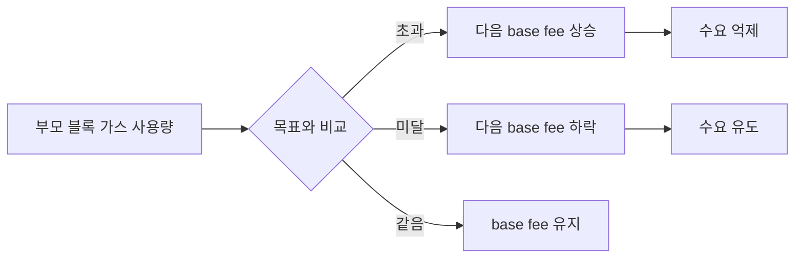

## 1. 가장 높은 가격을 적는 방식의 문제

EIP-1559 이전 이더리움 수수료는 1가격 경매에 가까웠다. 사용자는 `gasPrice`를 정해 트랜잭션을 내고, 채굴자는 높은 가격을 부른 거래부터 블록에 넣었다. 급하게 보내려면 다른 사용자가 얼마를 제시할지 예측해야 했고, 지갑의 추정이 빗나가면 과다 지불하거나 오랫동안 대기했다.

EIP-1559는 2021년 8월 London 업그레이드에서 활성화됐다. 블록마다 프로토콜이 계산하는 `base fee`를 만들고, 사용자는 검증자에게 줄 `priority fee`와 총 지불 상한 `max fee`를 정한다. 블록은 목표 사용량을 중심으로 일시적으로 커지거나 작아질 수 있다.


_EIP-1559 공식 사양. Type 2 거래, base fee, priority fee와 탄력적 블록 크기를 정의한다._

## 2. Type 2 트랜잭션

EIP-1559는 EIP-2718 typed transaction의 `0x02` 형식을 사용한다.

```text
0x02 || rlp([
  chain_id, nonce,
  max_priority_fee_per_gas,
  max_fee_per_gas,
  gas_limit, destination, amount, data, access_list,
  signature_y_parity, signature_r, signature_s
])
```

세 수수료를 구분해야 한다.

- `baseFeePerGas`: 블록 혼잡도에 따라 프로토콜이 계산하며 소각된다.
- `maxPriorityFeePerGas`: 사용자가 검증자 팁으로 허용한 상한이다.
- `maxFeePerGas`: base fee와 priority fee를 합쳐 사용자가 낼 최대 가격이다.

실제 가스당 지불 가격은 다음과 같다.

```text
effectiveGasPrice = min(
  maxFeePerGas,
  baseFeePerGas + maxPriorityFeePerGas
)
```

따라서 `maxFeePerGas`를 크게 설정했다고 항상 그만큼 지불하지 않는다. 실제 base fee와 필요한 tip만 사용하고 남는 한도는 계정에 남는다.

## 3. base fee는 어떻게 변하는가

부모 블록의 가스 사용량이 목표보다 많으면 다음 블록의 base fee가 오르고, 적으면 내려간다.

```text
nextBaseFee = parentBaseFee
  + parentBaseFee
  × (gasUsed - gasTarget)
  ÷ gasTarget
  ÷ 8
```

정확한 구현에는 증가·감소 방향의 정수 반올림과 최소 증가량 처리가 추가된다. 핵심은 한 블록에서 최대 약 12.5%씩 변한다는 점이다. 지갑은 현재 블록만 보고도 가까운 다음 블록의 최소 비용을 훨씬 안정적으로 예상할 수 있다.



## 4. 탄력적 블록 크기

EIP-1559 이후 블록에는 목표 가스와 최대 가스가 구분된다. 평상시 목표는 최대치의 절반이며, 갑작스러운 수요가 생기면 최대 2배 공간까지 일시적으로 흡수할 수 있다. 계속 목표보다 큰 블록이 만들어지면 base fee가 빠르게 올라 수요를 낮춘다.

이 설계는 블록 용량을 영구적으로 두 배 늘리는 것이 아니다. 평균은 목표 주변으로 돌아오게 하면서 순간적인 혼잡에 완충 공간을 제공한다.

## 5. 누가 수수료를 받는가

사용자가 낸 수수료는 두 갈래로 나뉜다.

```text
사용자 지불액
├─ base fee × gas used      → 소각
└─ priority fee × gas used  → 블록 제안자
```

base fee를 블록 제안자에게 주면 제안자가 혼잡도를 조작해 수익을 키울 유인이 생길 수 있다. 소각은 base fee를 프로토콜의 객관적 최소 가격으로 만들고 ETH를 이더리움 블록 공간의 결제 자산으로 유지한다.

다만 “EIP-1559가 항상 ETH를 디플레이션으로 만든다”는 설명은 부정확하다. 순공급 변화는 소각량뿐 아니라 PoS 발행량에도 달려 있다. 네트워크 활동이 낮으면 발행이 소각보다 많을 수 있다.

## 6. 메인넷에서 직접 확인

Etherscan의 최신 블록 목록에서는 각 블록의 Gas Used, Gas Limit, Base Fee와 Burnt Fees를 확인할 수 있다.


_메인넷 블록 탐색 화면. 블록마다 달라지는 base fee와 소각량을 확인했다._

사용자가 Type 2 거래에서 확인할 항목도 분명해진다.

1. `Gas Limit`은 실행에 허용한 최대 가스 양이다.
2. `Gas Used`는 실제 소비량이다.
3. `Base Fee`는 해당 블록의 프로토콜 가격이다.
4. `Max Priority Fee`는 검증자 팁의 상한이다.
5. `Txn Fee`는 실제 사용 가스에 effective gas price를 곱한 값이다.

`gas limit × max fee`는 잔액 검사를 위한 최악의 상한이지 실제 최종 비용이 아니다.

## 7. 예제로 계산하기

아래 조건에서 단순 ETH 전송이 21,000 gas를 사용했다고 가정한다.

```text
base fee        = 20 gwei
max priority fee= 2 gwei
max fee         = 50 gwei
```

실제 가스 가격은 `min(50, 20 + 2) = 22 gwei`이고 총비용은 다음과 같다.

```text
21,000 × 22 gwei = 462,000 gwei = 0.000462 ETH
```

그중 `0.00042 ETH`는 소각되고 `0.000042 ETH`가 블록 제안자에게 간다. 사용자가 허용한 50 gwei와 실제 22 gwei의 차액은 지불되지 않는다.

반대로 base fee가 49 gwei라면 tip으로 쓸 수 있는 공간은 `50 - 49 = 1 gwei`뿐이다. 검증자에게 실제 지급되는 priority fee는 1 gwei로 제한된다.

## 8. EIP-1559가 해결하지 못한 것

- 블록 공간 수요가 높으면 base fee 자체가 비싸진다.
- 지갑이 너무 낮은 `maxFeePerGas`를 정하면 거래가 대기한다.
- 블록 내부 순서와 MEV 문제는 사라지지 않는다.
- priority fee 경쟁은 여전히 가능하다.
- 실행 계층 가스비를 바꾼 것이지 L1 처리량을 근본적으로 확장한 것은 아니다.

즉 EIP-1559의 목표는 “가스비를 언제나 싸게”가 아니라 **포함 가격을 예측 가능하게 하고 순간 수요를 완충하며 과다 입찰을 줄이는 것**이다.

## 9. 정리

EIP-1559는 사용자가 다른 사람의 입찰가를 추측하던 구조를 블록 혼잡도 기반 base fee로 바꿨다. `maxFeePerGas`는 총상한, `maxPriorityFeePerGas`는 팁 상한, base fee는 소각되는 프로토콜 가격이다.

메인넷 블록을 살펴보니 EIP-1559를 이해하는 가장 좋은 방법은 지갑 화면의 “가스비”를 하나의 숫자로 보지 않고 **base fee, priority fee, gas used**로 분해하는 것이었다. 이후 EIP-4844가 blob 데이터에 별도의 수수료 시장을 설계할 때도 이 자기 조정 아이디어가 다시 사용된다.

## 참고 자료

- [EIP-1559: Fee market change for ETH 1.0 chain](https://eips.ethereum.org/EIPS/eip-1559)
- [ethereum.org Gas and fees](https://ethereum.org/developers/docs/gas/)
- [ethereum.org ETH issuance after The Merge](https://ethereum.org/roadmap/merge/issuance/)
- [Etherscan Ethereum Blocks](https://etherscan.io/blocks)

