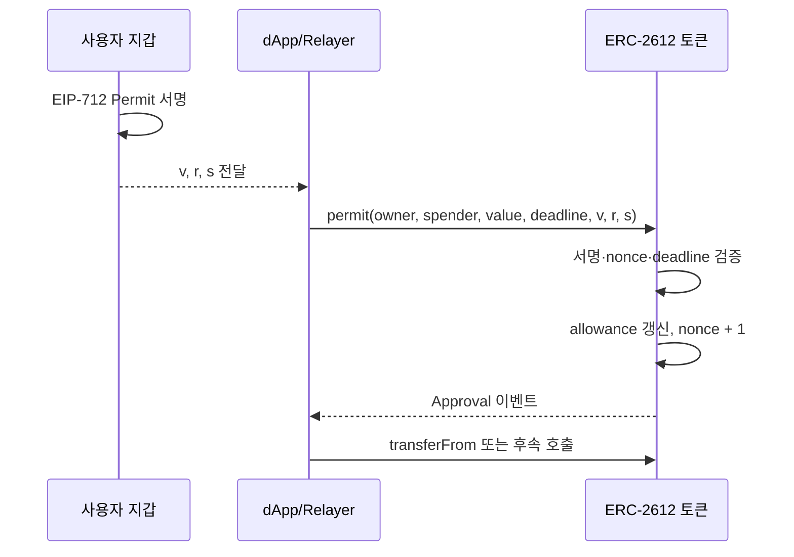

## 1. 왜 ERC-20에는 두 번의 트랜잭션이 필요할까

ERC-20 토큰을 DEX나 대출 프로토콜에 처음 맡길 때는 보통 `approve`와 실제 동작을 따로 실행한다. 예를 들어 토큰을 스왑하려면 먼저 라우터가 내 토큰을 가져갈 수 있도록 승인하고, 승인이 채굴된 뒤 다시 `swap`을 보낸다. 두 트랜잭션 모두 이더리움에서 트랜잭션이나 스마트 컨트랙트 코드를 실행할 때 지불하는 처리 수수료인 **가스비**가 들고 사용자는 네트워크 확인을 두 번 기다려야 한다.

ERC-2612는 이 문제를 **온체인 승인 대신 오프체인 서명**으로 해결한다. 토큰 소유자는 가스비 없이 EIP-712 메시지에 서명하고, 서명을 받은 상대방이나 프로토콜이 `permit`을 실행한다. 이후 승인된 동작을 같은 트랜잭션 안에서 이어 갈 수도 있다.


_ERC-2612 공식 문서에서 목적과 세 가지 추가 인터페이스를 확인_

공식 사양은 ERC-20에 다음 세 함수를 추가한다.

```solidity
function permit(
    address owner,
    address spender,
    uint256 value,
    uint256 deadline,
    uint8 v,
    bytes32 r,
    bytes32 s
) external;

function nonces(address owner) external view returns (uint256);
function DOMAIN_SEPARATOR() external view returns (bytes32);
```

## 2. permit이 승인으로 바뀌는 과정

전체 흐름은 다음과 같다.



서명 대상의 핵심은 다음 구조다.

```text
keccak256(
  0x1901 || DOMAIN_SEPARATOR ||
  keccak256(Permit(owner, spender, value, nonce, deadline))
)
```

`DOMAIN_SEPARATOR`에는 보통 토큰 이름, 버전, `chainId`, 검증 컨트랙트 주소가 들어간다. 같은 서명을 다른 체인이나 다른 토큰에서 재사용하지 못하게 만드는 도메인 경계다. `nonce`는 한 번 쓴 서명의 재사용을 막고, `deadline`은 서명이 유효한 마지막 시각을 정한다.

컨트랙트는 아래 조건을 모두 확인해야 한다.

- 현재 시각이 `deadline`을 넘지 않았는가
- `owner`가 영 주소가 아닌가
- 서명에 포함된 nonce가 현재 nonce와 같은가
- `ecrecover` 결과가 실제 `owner`인가

검증에 성공하면 allowance를 `value`로 바꾸고 nonce를 1 증가시키며 `Approval` 이벤트를 발생시킨다. 실패 시에는 반드시 revert한다.

## 3. approve와 permit의 차이

| 구분 | approve | permit |
|---|---|---|
| 승인 의사 표현 | 온체인 트랜잭션 | EIP-712 서명 |
| 누가 가스를 내는가 | 토큰 소유자 | 서명 제출자 |
| ETH가 없는 사용자 | 실행 불가 | 서명은 가능 |
| 재사용 방지 | 계정 트랜잭션 nonce | 토큰별 `nonces(owner)` |
| 만료 | 기본적으로 없음 | `deadline` |

permit이 가스를 없애는 것은 아니고, **사용자의 승인 트랜잭션을 없애고, 서명을 온체인에 제출하는 가스를 다른 주체가 낼 수 있게 한다**.

## 4. 메인넷 사례: Uniswap V2 LP 토큰

공식 ERC-2612 문서는 현재 사양이 Uniswap V2 구현과 같은 방향이라고 설명한다. 메인넷의 USDC/WETH Uniswap V2 Pair 주소 `0xB4e16d0168e52d35CaCD2c6185b44281Ec28C9Dc`를 Etherscan에서 확인했다.


_메인넷 Uniswap V2 USDC/WETH Pair. 검증된 ABI에서 `permit`, `nonces`, `DOMAIN_SEPARATOR`, `PERMIT_TYPEHASH`를 확인_

이 Pair 컨트랙트가 발행하는 LP 토큰은 `permit`을 제공한다. 사용자는 LP 토큰 제거 전에 별도 `approve`를 먼저 보내는 대신 서명한 permit을 라우터에 전달할 수 있다. Uniswap V2 Router의 `removeLiquidityWithPermit` 계열 함수는 승인과 유동성 제거를 한 호출 흐름으로 묶는다.

```solidity
function removeLiquidityWithPermit(
    address tokenA,
    address tokenB,
    uint liquidity,
    uint amountAMin,
    uint amountBMin,
    address to,
    uint deadline,
    bool approveMax,
    uint8 v, bytes32 r, bytes32 s
) external returns (uint amountA, uint amountB);
```

여기서 permit은 단순한 문법 개선이 아니라 실제 UX를 한 단계 줄이는 표준이다.

## 5. 구현할 때 놓치기 쉬운 점

### 5.1 서명은 공개 데이터다

사용자가 dApp에 전달한 서명은 제출 전까지 누구든 복사할 수 있다. 다만 서명 안의 `spender`, `value`, `nonce`, `deadline`이 고정되어 있어 공격자가 마음대로 내용을 바꿀 수는 없다. 그럼에도 dApp은 “내 트랜잭션만 permit을 먼저 제출할 것”이라고 가정하면 안 되고, permit이 이미 처리돼 nonce가 바뀌었을 가능성도 고려해야 한다.

### 5.2 무제한 승인 문제는 사라지지 않는다

permit도 결국 allowance를 설정한다. `value = type(uint256).max` 같은 무제한 승인을 요청하면 ERC-20 approve와 같은 위험을 가진다. UI는 승인 대상과 금액, 만료 시각을 사람이 읽을 수 있게 보여줘야 한다.

### 5.3 스마트 컨트랙트 지갑

기본 ERC-2612는 `ecrecover` 기반 EOA 서명을 전제로 한다. Safe 같은 컨트랙트 지갑은 동일 방식으로 서명할 수 없으므로 EIP-1271 지원 여부나 별도 확장을 확인해야 한다.

### 5.4 DAI permit과의 차이

DAI는 ERC-2612가 확정되기 전에 permit 패턴을 도입했다. DAI 방식은 `value` 대신 `allowed` 불리언을 쓰는 등 ABI와 의미가 다르다. 함수 이름이 `permit`이라고 해서 모두 ERC-2612라고 판단하면 안 된다.

## 6. 정리

ERC-2612가 해결한 핵심은 토큰 승인을 “누가 트랜잭션을 보내는가”에서 “누가 유효한 서명을 만들었는가”로 바꾼 것이다. 덕분에 승인과 후속 동작을 묶고, 사용자가 ETH 없이도 토큰 사용 권한을 표현할 수 있다. 반면 서명 피싱, 무제한 allowance, 구현별 호환성 문제는 그대로 남는다.

메인넷 컨트랙트를 확인해 보니 인터페이스만 보기보다 **서명 도메인, nonce, 실제 호출을 누가 제출하는지**를 함께 보는 것이 중요하다고 생각이든다.

## 참고 자료

- [ERC-2612: Permit Extension for EIP-20 Signed Approvals](https://eips.ethereum.org/EIPS/eip-2612)
- [EIP-712: Typed structured data hashing and signing](https://eips.ethereum.org/EIPS/eip-712)
- [Uniswap V2 USDC/WETH Pair on Etherscan](https://etherscan.io/address/0xb4e16d0168e52d35cacd2c6185b44281ec28c9dc#code)
- [Uniswap V2 Router02 reference](https://docs.uniswap.org/contracts/v2/reference/smart-contracts/router-02)

