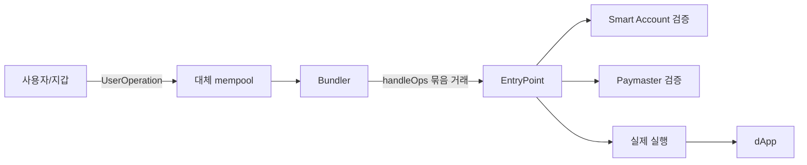

## 1. 이더리움 계정의 오래된 제약

이더리움의 일반 계정인 EOA는 개인키 서명이 곧 권한이다. 단순하고 강력하지만 사용자 경험에는 제약이 많다.

- 개인키를 잃으면 계정을 복구하기 어렵다.
- 모든 트랜잭션 수수료를 ETH로 내야 한다.
- 여러 동작을 원자적으로 묶으려면 별도 컨트랙트가 필요하다.
- 다중 서명, 일일 한도, 세션 키 같은 규칙을 EOA 자체에 넣을 수 없다.

계정 추상화(Account Abstraction)는 검증 로직을 고정된 ECDSA 규칙에서 스마트 컨트랙트 코드로 옮기려는 아이디어다. ERC-4337은 합의 계층을 바꾸지 않고 별도의 인프라와 `EntryPoint` 컨트랙트로 이를 구현한다.


_ERC-4337은 합의 규칙을 바꾸지 않고 상위 계층의 UserOperation과 EntryPoint를 사용_

## 2. 트랜잭션 대신 UserOperation

스마트 계정 사용자는 일반 트랜잭션을 바로 보내지 않는다. 실행 의도를 담은 `UserOperation`을 전용 mempool에 보낸다. Bundler는 여러 UserOperation을 모아 EntryPoint의 `handleOps`를 호출하는 하나의 이더리움 트랜잭션을 만든다.



UserOperation에는 다음과 같은 정보가 들어간다.

```text
sender, nonce, factory, factoryData, callData,
callGasLimit, verificationGasLimit, preVerificationGas,
maxFeePerGas, maxPriorityFeePerGas,
paymaster, paymasterData, signature
```

일반 트랜잭션과 비슷하지만 계정 생성 정보, 검증 가스, Paymaster, 임의 형식의 signature를 추가로 담는다. 서명의 의미를 이더리움 프로토콜이 정하지 않고 스마트 계정 구현이 정의한다는 점이 핵심이다.

## 3. 핵심 구성 요소 네 가지

### 3.1 Smart Account

사용자의 자산을 보유하고 자체 검증 규칙을 구현하는 컨트랙트다. 최소한 다음 인터페이스로 UserOperation을 검증한다.

```solidity
interface IAccount {
    function validateUserOp(
        PackedUserOperation calldata userOp,
        bytes32 userOpHash,
        uint256 missingAccountFunds
    ) external returns (uint256 validationData);
}
```

여기에서 ECDSA 한 개뿐 아니라 다중 서명, passkey, 세션 키, 소셜 복구 등의 정책을 구현할 수 있다.

### 3.2 Bundler

Bundler는 UserOperation을 수집하고 시뮬레이션한 뒤 여러 개를 묶어 일반 트랜잭션으로 제출한다. 검증에 실패하거나 수수료를 지불하지 않을 작업을 무작정 넣으면 Bundler가 손해를 보기 때문에 사전 시뮬레이션과 검증 규칙이 중요하다.

### 3.3 EntryPoint

모든 참여자가 신뢰하는 싱글톤 컨트랙트다. `handleOps`에서 검증과 실행을 조정하고, 필요한 가스를 미리 확보한 뒤 실제 비용을 정산한다.

```solidity
function handleOps(
    PackedUserOperation[] calldata ops,
    address payable beneficiary
) external;
```

### 3.4 Paymaster

사용자 대신 가스를 내는 컨트랙트다. 서비스가 신규 사용자의 첫 거래를 후원하거나 ERC-20 토큰을 미리 받아 ETH 가스를 대신 낼 수 있다. “가스비가 무료”가 아니라 누가 어떤 조건으로 대신 지불하는지를 코드로 정하는 구조다.

## 4. 메인넷에서 확인한 EntryPoint

메인넷의 EntryPoint v0.7 주소 `0x0000000071727De22E5E9d8BAf0edAc6f37da032`를 확인했다. Etherscan의 검증된 ABI에는 `handleOps`, `getUserOpHash`, `depositTo`, `addStake`와 `UserOperationEvent`가 존재한다.


_ERC-4337 EntryPoint v0.7 메인넷 컨트랙트. UserOperation 묶음 실행과 예치금·스테이크를 관리_

EntryPoint는 중앙 서버가 아니다. 온체인에 배포된 검증·정산의 공통 지점이다. Bundler는 서로 경쟁할 수 있지만 동일 버전의 EntryPoint를 기준으로 UserOperation 유효성을 판단한다.

## 5. 사용자가 얻는 변화

### 가스 대납과 ERC-20 수수료

Paymaster가 정책에 맞는 사용자의 가스를 대납할 수 있다. 게임이 첫 행동을 후원하거나, 사용자가 ETH 대신 스테이블코인으로 비용을 지불하는 UX를 만들 수 있다.

### 여러 동작의 일괄 실행

토큰 승인과 스왑처럼 연속된 호출을 한 UserOperation으로 묶을 수 있다. 중간 단계만 성공하는 것을 막고 확인 횟수도 줄인다.

### 사용자별 보안 정책

고액 송금에는 추가 서명을 요구하고, 게임용 세션 키에는 특정 컨트랙트와 금액만 허용하며, 보호자 기반 복구를 구현할 수 있다.

### 계정의 선계산 주소

Factory와 `CREATE2`를 이용해 아직 배포하지 않은 계정 주소도 미리 계산하고 자산을 받을 수 있다. 첫 UserOperation에서 계정 배포와 실행을 함께 처리한다.

## 6. 검증과 실행을 왜 분리할까

Bundler가 검증되지 않은 작업을 실행하다가 마지막에 revert하면 공격자는 적은 비용으로 Bundler의 자원을 소모시킬 수 있다. ERC-4337은 검증 단계의 저장소 접근과 opcode에 제한을 두고, EntryPoint가 “검증 성공 후 한 번만 실행”되도록 조정한다.

Paymaster와 Factory는 여러 사용자가 공유하므로 이들의 상태 변화가 많은 UserOperation을 한꺼번에 무효화할 수도 있다. 표준은 평판과 스테이크 규칙을 이용해 DoS 비용을 높인다. 이것은 단순 ABI보다 운영 규칙까지 포함한 표준인 이유다.

## 7. 한계와 보안 고려사항

- EntryPoint, 계정 구현, Bundler, Paymaster까지 공격 표면이 넓어진다.
- 시뮬레이션 결과와 실제 포함 시점의 상태가 달라질 수 있다.
- 잘못된 Paymaster 정책은 무제한 가스 후원 공격으로 이어질 수 있다.
- 업그레이드 가능한 스마트 계정은 관리자 키와 구현 변경 위험이 있다.
- ERC-4337 트랜잭션은 일반 mempool이 아니라 별도 UserOperation 인프라에 의존한다.

계정 추상화는 개인키를 없애는 기술이라기보다 **인증·복구·가스 지불 규칙을 프로그래밍 가능하게 만드는 기술**이다. 유연성이 커진 만큼 지갑 구현의 보안 책임도 커진다.

## 8. 정리

ERC-4337은 이더리움 합의를 변경하지 않고 `UserOperation → Bundler → EntryPoint → Smart Account`라는 새 실행 경로를 만들었다. 메인넷 EntryPoint를 직접 확인하면서 계정 추상화가 개념 제안에 머문 것이 아니라 실제 컨트랙트와 이벤트로 운영되는 상위 프로토콜이라는 점을 확인했다.

EIP-7702가 기존 EOA에 코드 위임 능력을 더한다면, ERC-4337은 별도 스마트 계정을 중심으로 사용자 작업을 수집·검증·실행하는 생태계에 가깝다. 둘은 경쟁 관계라기보다 함께 사용할 수 있도록 하고 있다.

## 참고 자료

- [ERC-4337: Account Abstraction Using Alt Mempool](https://eips.ethereum.org/EIPS/eip-4337)
- [ERC-4337 Documentation](https://docs.erc4337.io/)
- [EntryPoint v0.7 on Etherscan](https://etherscan.io/address/0x0000000071727de22e5e9d8baf0edac6f37da032)
- [eth-infinitism account-abstraction](https://github.com/eth-infinitism/account-abstraction)

