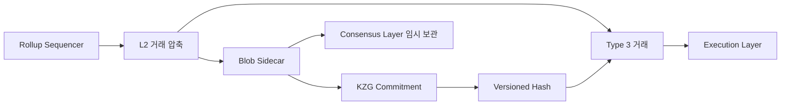

## 1. Rollup의 계산보다 데이터가 비쌌다

Rollup은 많은 사용자 거래를 L2에서 실행한 뒤 압축한 데이터와 결과를 이더리움에 게시한다. 이 데이터가 공개돼야 누구나 상태를 재구성하고 잘못된 결과를 검증할 수 있다. EIP-4844 이전에는 데이터를 L1 트랜잭션의 `calldata`에 넣었다.

calldata는 EVM이 읽을 수 있고 영구적으로 보존된다. Rollup 데이터는 보통 실행에 직접 사용할 필요가 없고 검증 기간 동안만 충분히 공개되면 되는데, 영구 실행 데이터와 같은 시장에서 비싼 비용을 지불한 셈이다.

EIP-4844, Proto-Danksharding은 Rollup 전용 임시 데이터 공간인 **blob**과 Type 3 트랜잭션을 도입했다. 2024년 3월 Dencun 업그레이드에서 메인넷에 활성화됐다.


_EIP-4844 공식 문서. EVM이 직접 읽지 않는 대용량 blob과 그 commitment를 도입_

## 2. Blob이 calldata와 다른 점

| 항목 | calldata | blob |
|---|---|---|
| EVM에서 내용 읽기 | 가능 | 불가능 |
| 보존 | 실행 체인에 영구 보존 | 합의 노드가 제한된 기간 보관 |
| 수수료 시장 | 일반 execution gas | 별도 blob gas |
| 주요 목적 | 함수 입력·영구 데이터 | Rollup 데이터 가용성 |
| 컨트랙트 접근 | 바이트 전체 | versioned hash/commitment |

blob은 4,096개의 field element로 이루어지고 각 원소는 32바이트다. 전체 크기는 131,072바이트, 약 128KiB다. blob 본문은 실행 계층 블록 안에 직접 들어가지 않고 consensus layer에서 sidecar로 전파된다.

EVM은 blob 내용을 읽을 수 없지만 `BLOBHASH` opcode로 versioned hash를 얻을 수 있다. 컨트랙트는 이를 이용해 거래가 약속한 blob과 연결됐는지 검증한다.

## 3. Type 3 Blob Transaction

Blob 트랜잭션은 EIP-2718의 타입 `0x03`이다.

```text
[chain_id, nonce,
 max_priority_fee_per_gas, max_fee_per_gas,
 gas_limit, to, value, data, access_list,
 max_fee_per_blob_gas, blob_versioned_hashes,
 y_parity, r, s]
```

일반 EIP-1559 수수료 필드 외에 `max_fee_per_blob_gas`와 `blob_versioned_hashes`가 추가된다. `to`는 반드시 20바이트 주소여야 하므로 blob 트랜잭션으로 컨트랙트를 생성할 수 없다.

실제 네트워크 전파에서는 위 실행 payload에 blob 본문, KZG commitment와 proof가 sidecar로 함께 전달된다.



## 4. KZG commitment는 왜 필요한가

블록 안에 128KiB blob을 그대로 영구 저장하지 않더라도 거래가 특정 데이터를 약속했다는 사실은 검증해야 한다. KZG polynomial commitment는 큰 blob을 짧은 commitment로 대표하고, 특정 지점의 값이 맞다는 proof를 검증할 수 있게 한다.

EIP-4844는 point evaluation precompile을 추가해 commitment와 proof를 검증한다. 이것은 향후 모든 노드가 모든 데이터를 받지 않고 일부만 표본 검사하는 Data Availability Sampling으로 확장하기 위한 형식이기도 하다.

Proto-Danksharding이라는 이름의 “proto”는 아직 전체 danksharding이 아니라는 뜻이다. 초기 EIP-4844 단계에서는 모든 consensus node가 blob을 내려받지만 일정 기간 후 삭제할 수 있다.

## 5. Blob만의 수수료 시장

blob gas는 일반 실행 가스와 별도 시장을 사용한다. Rollup 데이터 수요가 늘어도 일반 스마트 컨트랙트 실행 가스와 직접 같은 가격으로 경쟁하지 않게 한다.

EIP-4844의 blob base fee도 EIP-1559처럼 사용량에 반응한다. 블록의 blob 사용량이 목표보다 계속 높으면 `excess_blob_gas`가 늘고 다음 blob base fee가 상승한다. 목표보다 낮으면 excess가 줄며 가격이 내려간다.

```text
blob fee = blob gas used × blob base fee
```

사용자는 `max_fee_per_blob_gas`로 지불 상한을 둔다. blob base fee는 소각되며 블록 제안자가 마음대로 정하지 않는다.

네트워크 업그레이드로 blob 목표·최대 개수는 조정될 수 있으므로 초창기 수치를 영구 규칙처럼 외우기보다 현재 네트워크 사양을 확인해야 한다. EIP-4844가 처음 도입한 핵심은 개수 자체보다 **독립된 임시 데이터 공간과 수수료 시장**이다.

## 6. 메인넷에서 실제 Blob 확인

Blobscan의 최신 블록 화면에서 블록별 blob 개수, blob 사용량, 제출 주소와 Type 3 트랜잭션을 확인했다.


_Blobscan의 메인넷 블록 목록. Rollup들이 올린 blob과 별도 blob 수수료 시장을 확인_

실제 사용 주체는 Optimism, Base, Arbitrum, zkSync 같은 Rollup batch poster다. Sequencer가 L2 거래를 모아 압축하고 blob으로 L1에 게시한다. 일반 L2 사용자는 Type 3 거래를 직접 만들지 않지만, 결과적으로 L2 거래 수수료의 데이터 게시 부분이 줄어드는 효과를 받는다.

## 7. Blob은 왜 지워도 되는가

Rollup은 영원히 모든 원시 batch 데이터를 consensus node에 보관해 달라는 것이 아니라, 상태를 검증하고 challenge를 제기하는 데 충분한 기간 동안 데이터 가용성을 요구한다. 일정 기간 뒤에는 다음 주체가 과거 데이터를 보존할 수 있다.

- Rollup 프로젝트의 archive node
- 블록 탐색기와 데이터 제공자
- Portal Network 같은 분산 보존 계층
- 사용자가 직접 운영하는 인덱서

Ethereum이 보장하는 것은 정해진 가용성 기간이며 영구 역사 조회 서비스가 아니다. 따라서 “blob이 삭제되면 L2 상태가 사라진다”는 설명은 맞지 않다. 확정된 상태 commitment는 L1에 남고, blob은 그 상태 전이를 검증할 원시 데이터 역할을 한다.

## 8. 보안과 한계

### 8.1 Blob은 범용 저장소가 아니다

EVM에서 내용을 읽을 수 없고 시간이 지나면 consensus node에서 삭제된다. NFT metadata나 컨트랙트가 나중에 직접 읽어야 하는 값을 blob에만 넣으면 안 된다.

### 8.2 L1 가스비를 직접 낮추는 기능이 아니다

핵심 수혜자는 L1에 데이터를 게시하는 Rollup이다. L1의 일반 토큰 전송과 스마트 컨트랙트 실행 비용이 반드시 크게 내려가는 것은 아니다.

### 8.3 Blob 공간도 희소하다

여러 Rollup이 동시에 blob을 많이 사용하면 blob base fee가 상승한다. 별도 시장은 경쟁을 분리할 뿐 무한한 무료 공간을 만들지 않는다.

### 8.4 데이터 보존 전략이 필요하다

가용성 보장 기간 이후 과거 blob이 필요한 서비스는 자체 archive나 외부 데이터 공급자를 준비해야 한다. 저렴한 비용과 영구 보존 사이의 명시적인 trade-off다.

### 8.5 KZG 신뢰 설정

KZG commitment는 trusted setup을 사용한다. Ethereum은 다수 참여자의 공개 ceremony를 통해 한 명만 정직하게 비밀을 폐기해도 안전한 방식으로 파라미터를 만들었지만, 이 암호학적 전제를 이해할 필요가 있다.

## 9. 정리

EIP-4844는 Rollup 데이터를 EVM 실행 데이터와 분리해 blob이라는 임시 공간에 넣었다. Type 3 거래, KZG commitment, sidecar 전파, 독립 blob fee market을 한 번에 도입했고 미래 Data Availability Sampling으로 이어질 형식을 먼저 배치했다.

Blobscan에서 실제 블록을 살펴보니 “L2 수수료가 낮아졌다”는 결과보다 그 원인이 명확해졌다. Rollup이 더 이상 영구 calldata 가격을 지불하지 않고 **검증에 필요한 기간만 데이터 가용성을 구매하기 때문**이다. EIP-4844는 Rollup 데이터만을 위한 두 번째 시장을 만든 셈이다.

## 참고 자료

- [EIP-4844: Shard Blob Transactions](https://eips.ethereum.org/EIPS/eip-4844)
- [ethereum.org Dencun FAQ](https://ethereum.org/roadmap/dencun/)
- [ethereum.org Blockchain data storage strategies](https://ethereum.org/developers/docs/data-availability/blockchain-data-storage-strategies/)
- [Blobscan](https://blobscan.com/blocks)
- [KZG Ceremony](https://ceremony.ethereum.org/)

