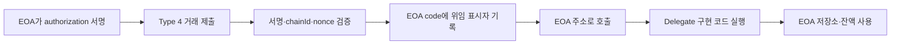

## 1. EOA 주소를 바꾸지 않고 기능을 추가할 수 있을까

EOA는 개인키로 제어되고 코드가 없는 이더리움 계정이다. 스마트 계정으로 이동하면 일괄 호출, 가스 대납, 세션 키 같은 기능을 얻을 수 있지만 기존 주소의 자산·승인·온체인 이력을 새 계정으로 옮겨야 한다.

EIP-7702는 기존 EOA가 **다른 컨트랙트의 코드를 자신의 코드처럼 실행하도록 위임**할 수 있게 한다. 2025년 5월 Pectra 업그레이드에서 활성화됐으며 Type 4, 즉 Set Code 트랜잭션을 추가했다.


_EIP-7702 공식 사양. EOA의 코드 위임과 새로운 Type 4 트랜잭션을 정의_

## 2. Authorization List와 위임 표시자

Type 4 트랜잭션은 기존 EIP-1559 필드에 `authorization_list`를 추가한다.

```text
0x04 || rlp([
  chain_id, nonce, max_priority_fee_per_gas, max_fee_per_gas,
  gas_limit, destination, value, data, access_list,
  authorization_list, signature_y_parity, signature_r, signature_s
])
```

각 authorization은 다음 값을 가진다.

```text
[chain_id, address, nonce, y_parity, r, s]
```

- `chain_id`: 위임이 유효한 체인
- `address`: 실행을 위임할 구현 컨트랙트
- `nonce`: 재사용을 막는 EOA nonce
- `y_parity, r, s`: 권한을 주는 EOA의 서명

검증에 성공하면 EOA의 code가 `0xef0100 || address` 형태의 **delegation indicator**로 설정된다. EVM이 이 계정을 호출하면 표시자가 가리키는 구현 컨트랙트의 코드를 사용하되 저장소와 `address(this)` 등 실행 문맥은 EOA의 것을 사용한다. 동작 관점에서는 `delegatecall`과 비슷하지만 프로토콜 수준에서 계정 코드를 해석한다.



## 3. 한 번만 적용되는가

초기 논의와 달리 EIP-7702의 위임은 트랜잭션이 끝난 뒤에도 남는다. 사용자가 다른 구현으로 다시 위임하거나 영 주소로 위임을 해제할 때까지 지속된다. 이 점은 반복 가스를 줄이지만, 악성 코드에 서명한 피해도 지속될 수 있다.

또한 Type 4 트랜잭션의 발신자와 authorization을 서명한 계정은 다를 수 있다. Relayer가 가스를 내고 사용자의 EOA에 위임을 설정하는 sponsored flow가 가능하다.

## 4. 무엇을 만들 수 있는가

### 일괄 실행

승인, 스왑, 예치를 한 번에 처리하는 `executeBatch`를 EOA에서 실행할 수 있다. 사용자는 기존 주소를 유지하면서 여러 번의 확인을 한 번으로 줄인다.

### 가스 대납

다른 계정이 Type 4 트랜잭션을 제출할 수 있어 신규 사용자가 ETH 없이 첫 동작을 수행할 수 있다. ERC-4337의 Bundler·Paymaster 흐름과 연결할 수도 있다.

### 세션 키와 제한 권한

게임이나 반복 작업에서 짧은 기간 특정 함수만 호출할 수 있는 키를 구현 코드가 검증하도록 만들 수 있다.

### 기존 EOA의 ERC-4337 참여

위임 코드를 ERC-4337 호환 계정으로 구성하면 기존 EOA 주소가 UserOperation 흐름에 참여할 수 있다. 자산을 새 주소로 옮기지 않아도 스마트 계정 기능을 단계적으로 도입할 수 있다.

## 5. 메인넷 Type 4 거래 확인

Etherscan에서 트랜잭션 `0x61959fb529ea796323676aac60a8f1a0a8b2cc5c6ce778cab08e4f5b0db8952c`을 확인했다. 상세 화면에 `Txn Type: 4 (EIP-7702)`가 표시되고, EOA가 `OKX: EIP-7702 Delegator`로 위임된 뒤 토큰 전송과 브리지 호출을 수행한 흔적을 볼 수 있다.


_Pectra 이후 메인넷에 실제 포함된 EIP-7702 Type 4 트랜잭션._

이 사례는 EIP-7702가 지갑의 미래 기능을 설명하는 문서에 그치지 않고, 이미 메인넷 트랜잭션 형식과 계정 상태에 반영된 프로토콜 변경임을 보여준다.

## 6. 보안 모델이 크게 바뀌는 지점

### 6.1 EOA는 더 이상 “코드가 없는 계정”이 아니다

과거에는 `address.code.length == 0`이면 EOA라고 보는 코드가 많았다. EIP-7702 이후 EOA도 위임 표시자를 가진다. `tx.origin == msg.sender`에 기대어 재진입이나 플래시론을 막는 구현 역시 깨질 수 있다. 계정 유형을 기준으로 보안을 결정하기보다 실제 권한과 호출 효과를 검증해야 한다.

### 6.2 위임 서명은 계정 제어권에 가깝다

일반 dApp이 사용자에게 임의 구현 주소로의 authorization을 서명시켜서는 안 된다. 위임된 코드는 EOA의 자산과 저장소를 다룰 수 있다. 공식 사양도 지갑이 신뢰할 수 있는 구현을 엄격히 검토해야 한다고 경고한다.

### 6.3 초기화 선점

일반 컨트랙트는 배포 생성자에서 소유자와 중요 상태를 초기화한다. 7702 위임 코드는 별도의 배포 과정 없이 기존 EOA 저장소에서 실행되므로 초기화 함수가 안전하지 않으면 다른 사람이 먼저 상태를 차지할 수 있다.

### 6.4 체인 간 재사용

authorization의 `chain_id`가 0이면 여러 체인에서 유효할 수 있다. 주소와 상태가 다른 체인에서 같은 서명이 뜻밖의 권한을 만들 수 있으므로 특별한 이유가 없다면 특정 chainId에 묶는 편이 안전하다.

### 6.5 해제만으로 저장소가 지워지지 않는다

위임을 바꿔도 EOA에 기록된 저장소 상태는 그대로 남는다. 구현 교체 시 저장소 레이아웃 충돌과 이전 권한 데이터가 새 코드에서 어떻게 해석되는지 확인해야 한다.

## 7. 정리

EIP-7702는 “EOA는 코드가 없다”는 전제를 바꿨다. 기존 주소를 유지하며 배치, 가스 대납, 세션 키와 같은 스마트 계정 기능을 사용할 수 있지만, authorization 서명 하나가 광범위한 권한을 줄 수 있다.

메인넷 Type 4 거래를 확인하면서 가장 중요한 변화는 신뢰라고 느꼈다. 앞으로 지갑과 dApp은 주소가 EOA인지 컨트랙트인지 구분하는 데 머물지 말고, **어떤 코드에 위임됐고 그 코드가 무엇을 할 수 있는지**를 보여줘야 한다.

## 참고 자료

- [EIP-7702: Set Code for EOAs](https://eips.ethereum.org/EIPS/eip-7702)
- [ethereum.org Pectra EIP-7702 guidelines](https://ethereum.org/roadmap/pectra/7702/)
- [Etherscan Pectra Upgrade 설명](https://info.etherscan.com/pectra-upgrade-whats-new-and-how-to-track-it-on-etherscan/)
- [메인넷 Type 4 예시 거래](https://etherscan.io/tx/0x61959fb529ea796323676aac60a8f1a0a8b2cc5c6ce778cab08e4f5b0db8952c)

