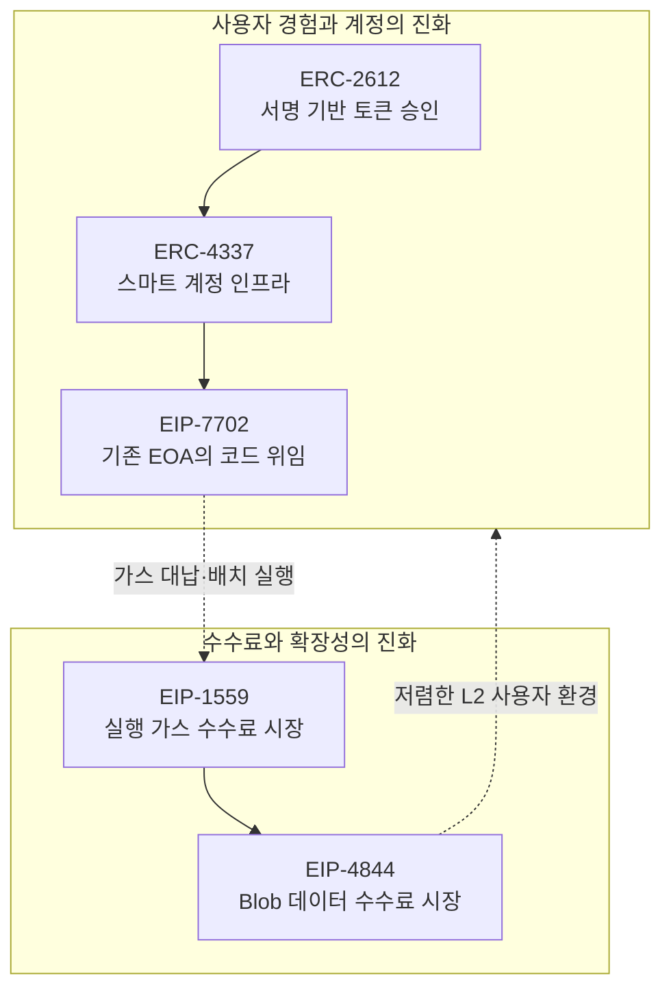

## 1. 미션을 시작하며

EIP(Ethereum Improvement Proposal)는 이더리움의 프로토콜, 애플리케이션 인터페이스와 생태계의 공통 규칙을 제안하는 문서다. **왜 등장했는지, 어떤 문제를 해결했는지, 메인넷에서는 어떻게 사용되는지**를 기준으로 다섯 가지 EIP를 공부했다.

이번에 선택한 주제는 다음과 같다.

| EIP | 주제 | 해결하려는 문제 | 분류 |
|---|---|---|---|
| ERC-2612 | Permit | ERC-20 승인에 별도 트랜잭션이 필요한 문제 | ERC |
| ERC-4337 | Account Abstraction | EOA의 고정된 인증·가스 지불 방식 | ERC |
| EIP-7702 | Set Code for EOAs | 기존 EOA 주소를 유지하며 스마트 계정 기능 사용 | Core |
| EIP-1559 | Fee Market | 불안정한 1가격 가스비 경매 | Core |
| EIP-4844 | Blob Transactions | Rollup의 비싼 calldata 게시 비용 | Core |

_Etherscan과 Blobscan에서 실제 메인넷 적용 사례를 확인_

## 2. 전체 글 바로가기

### [ERC-2612: approve 트랜잭션을 서명으로 바꾸는 Permit](/posts/eip-2612-permit/)

ERC-20을 dApp에서 사용하려면 `approve`와 실제 실행을 따로 보내야 한다. ERC-2612는 EIP-712 서명을 이용해 allowance를 변경함으로써 사용자의 승인 트랜잭션을 줄인다. `DOMAIN_SEPARATOR`, nonce와 deadline이 재사용 공격을 어떻게 막는지 분석하고, 메인넷 Uniswap V2 LP 토큰의 `permit` 구현을 확인했다.

### [ERC-4337: 프로토콜 변경 없이 구현한 계정 추상화](/posts/eip-4337-account-abstraction/)

ERC-4337은 별도의 합의 계층 변경 없이 `UserOperation`, Bundler, EntryPoint, Paymaster를 이용해 스마트 계정을 구현한다. 가스 대납, 배치 실행, 소셜 복구와 세션 키가 가능한 이유를 실행 흐름 중심으로 정리하고, 실제 메인넷 EntryPoint v0.7 컨트랙트를 살펴봤다.

### [EIP-7702: 기존 EOA를 스마트 계정처럼 만드는 코드 위임](/posts/eip-7702-set-code-eoa/)

Pectra 업그레이드에 포함된 EIP-7702는 EOA가 다른 컨트랙트 코드에 실행을 위임할 수 있게 한다. Type 4 트랜잭션과 Authorization List, delegation indicator의 구조를 분석하고 메인넷의 OKX EIP-7702 Delegator 사용 거래를 확인했다. 위임 서명 피싱과 저장소 충돌 같은 새로운 보안 문제도 함께 다뤘다.

### [EIP-1559: 가스비 경매를 예측 가능한 수수료 시장으로](/posts/eip-1559-fee-market/)

EIP-1559는 사용자가 다른 사람의 입찰가를 추측하던 가스비 시장을 `base fee + priority fee` 구조로 바꿨다. base fee 조정 공식과 탄력적 블록 크기, 소각 구조를 계산 예제와 함께 설명하고, Etherscan의 실제 메인넷 블록에서 base fee와 burnt fee를 확인했다.

### [EIP-4844: Blob 트랜잭션으로 Rollup 데이터 비용 낮추기](/posts/eip-4844-blob-transactions/)

EIP-4844는 Rollup 데이터가 비싼 영구 calldata를 사용하던 문제를 blob이라는 임시 데이터 공간으로 해결했다. Type 3 트랜잭션, KZG commitment, blob sidecar와 독립 수수료 시장을 분석하고 Blobscan에서 실제 Rollup blob 게시 현황을 확인했다.

## 3. 다섯 EIP의 연결 관계

다섯 EIP는 두 흐름으로 연결됐다.

ERC-2612는 토큰 승인 한 단계를 서명으로 바꿨고, ERC-4337은 계정의 인증과 가스 지불 전체를 프로그래밍 가능하게 만들었다. EIP-7702는 이미 사용 중인 EOA가 주소를 바꾸지 않고 이 스마트 계정 생태계에 참여할 길을 열었다.

EIP-1559는 실행 블록 공간의 가격을 수요에 따라 자동 조정했고, EIP-4844는 같은 발상을 Rollup 전용 데이터 공간에 적용했다. EIP-4844가 일반 L1 가스를 직접 싸게 만드는 제안이 아니라 별도의 blob 시장을 만든 제안이라는 점이 특이했다.

## 4. 공통적으로 발견한 설계 원칙

### 서명은 트랜잭션과 다르다

ERC-2612와 EIP-7702 모두 사용자가 서명하고 제삼자가 온체인에 제출할 수 있다. 누가 가스를 내는지와 누가 권한을 승인했는지를 분리하면 UX가 좋아지지만, 서명의 domain, nonce, deadline과 권한 범위를 정확히 설계해야 한다.

### 실행과 검증을 분리한다

ERC-4337은 `validateUserOp`와 실제 실행을 나누고, EIP-4844는 EVM 실행 데이터와 데이터 가용성 blob을 분리한다. 모든 기능을 하나의 계층에서 처리하지 않고 목적에 맞는 검증 경로를 두는 방식이다.

### 가격은 수요를 반영해야 한다

EIP-1559의 base fee와 EIP-4844의 blob base fee는 모두 사용량이 목표보다 높으면 상승하고 낮으면 하락한다. 다만 실행 가스와 blob gas는 서로 다른 자원을 나타내므로 독립된 시장을 사용한다.

### 편의 기능은 새로운 신뢰 경계를 만든다

Permit의 allowance, ERC-4337 Paymaster, EIP-7702 delegate code는 사용 과정을 줄여 주지만 피싱이나 잘못된 구현의 피해 범위도 키울 수 있다. 기능을 지원한다는 사실보다 사용자가 정확히 무엇을 승인하는지 보여 주는 지갑 UI가 중요하다.

## 5. 공부하며 바로잡은 오해

| 처음 가졌던 생각 | 확인한 내용 |
|---|---|
| Permit은 가스가 들지 않는다 | 서명자는 가스를 내지 않지만 누군가는 서명을 온체인에 제출해야 한다 |
| Account Abstraction은 개인키를 없앤다 | 인증 규칙을 코드로 확장하는 것이며 어떤 키·복구 정책을 쓸지는 구현에 달렸다 |
| EIP-7702 위임은 한 거래 동안만 유지된다 | 최종 사양의 delegation은 명시적으로 변경하거나 해제할 때까지 지속된다 |
| EIP-1559는 가스비를 항상 낮춘다 | 가격 예측과 순간 혼잡 처리를 개선하지만 수요가 높으면 base fee도 높다 |
| Blob은 저렴한 영구 저장소다 | EVM이 내용을 읽을 수 없고 제한된 기간만 가용성이 보장된다 |

## 6. 마치며

EIP 문서는 짧은 인터페이스, 수식만 봐야할 것이 아니라 생태계에 대한 글을 담고 있다. 이번에는 공식 사양을 출발점으로 삼고 OpenZeppelin·ethereum.org 문서와 메인넷 탐색기를 함께 확인했다. 그 과정에서 표준을 이해하려면 다음 네 질문을 반복하는 것이 효과적이었다.

1. 기존 방식에서 누가 어떤 불편이나 비용을 겪었는가?
2. 새 필드와 인터페이스는 어떤 신뢰 가정을 추가하는가?
3. 실패하거나 악용됐을 때 피해 범위는 어디까지인가?
4. 실제 메인넷 컨트랙트와 트랜잭션에서 어떻게 관찰되는가?

새로운 EIP를 접하게 된다면 요약보다 **문제–설계–사용 사례–한계**의 흐름으로 분석하는게 좋을 듯 하다.

## 참고 자료

- [Ethereum Improvement Proposals](https://eips.ethereum.org/)
- [ERC-2612](https://eips.ethereum.org/EIPS/eip-2612)
- [ERC-4337](https://eips.ethereum.org/EIPS/eip-4337)
- [EIP-7702](https://eips.ethereum.org/EIPS/eip-7702)
- [EIP-1559](https://eips.ethereum.org/EIPS/eip-1559)
- [EIP-4844](https://eips.ethereum.org/EIPS/eip-4844)

